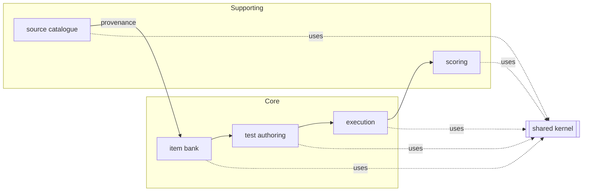
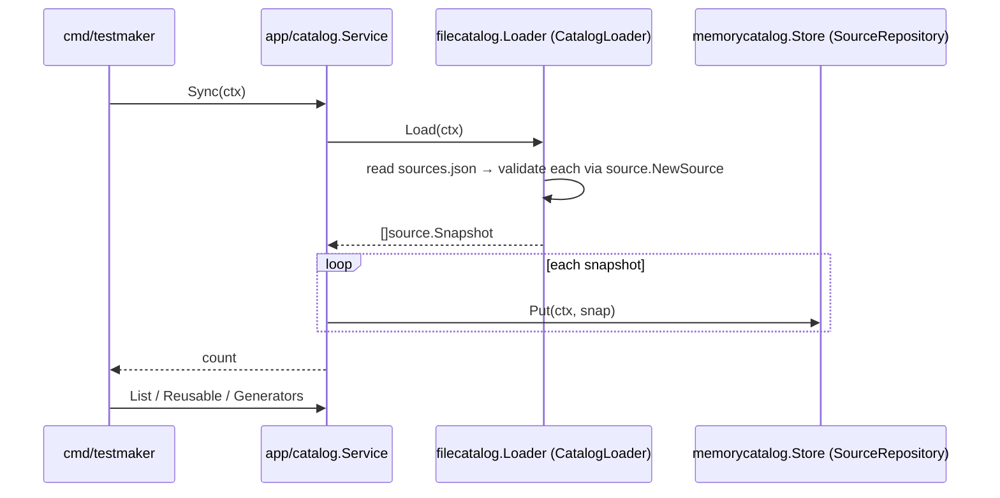

# Testmaker — Architecture

Authoritative system-design narrative. The **layering rules themselves are
enforced by [`.go-arch-lint.yml`](.go-arch-lint.yml)** — this document explains
them; that file is the source of truth. Ubiquitous terms are defined in
[UBIQUITOUS.md](UBIQUITOUS.md); the domain model in [DDD.md](DDD.md); the build
order in [IMPLEMENTATION_PLAN.md](IMPLEMENTATION_PLAN.md).

---

## 1. System Overview

Testmaker builds and administers cognitive-aptitude / IQ tests — logic-first
(figure series, matrices, Mensa-style figure reasoning, odd-one-out,
syllogisms), plus numerical, verbal, spatial and speed/working-memory families.
It is three cooperating subsystems over one shared item model:

| Subsystem | Responsibility |
| --- | --- |
| **Sourcing & item bank** | Catalogue external **sources**, **fetch** or **generate** items, normalize and store them in the **item bank** with provenance, license and difficulty. |
| **Designer / generator** | Author items by hand and **procedurally generate** them from rules; compose items into **tests** (sections, timing, fixed or adaptive delivery). |
| **Renderer / executor** | **Administer** a test (timing, navigation, adaptive item selection), capture responses, and **score** (raw, percentile band, IQ-scaled) with per-item feedback. |

Design goals: a pure, testable domain; swappable storage and fetch technologies;
speed and difficulty as first-class, machine-checked concepts; and a build where
architectural drift fails CI rather than review.

---

## 2. Architectural style — DDD + Hexagonal + Clean Architecture

Testmaker fuses three disciplines and makes their central rule mechanical:

- **Domain-Driven Design** — the code is partitioned into **bounded contexts**
  (source, item, testset, session, scoring) with a **shared kernel**
  (`domain/shared`). Each context owns its aggregates, value objects and
  invariants. Terms come from [UBIQUITOUS.md](UBIQUITOUS.md).
- **Hexagonal (ports & adapters)** — the application core talks to the outside
  world only through **ports** (interfaces in `ports/`). **Driven** ports are
  called by the core (repositories, fetcher, generator, scorer); **driving**
  ports drive the core (catalogue loader, executor). **Adapters** implement
  ports and live at the edge.
- **Clean Architecture** — dependencies point **inward only**. Concentric rings,
  innermost first: domain → ports → app → adapters → cmd.

### 2.1 Dependency rule

```
domain  <-  ports  <-  app  <-  adapters  <-  cmd
```

| Ring | Package(s) | May import | External deps |
| --- | --- | --- | --- |
| 1 Domain | `domain/**` | (only other `domain/**`) | **none** (stdlib only) |
| 2 Ports | `ports/**` | `domain` | none |
| 2 App | `app/**` | `domain`, `ports` | none |
| 3 Adapters | `adapters/<vendor>/<role>/<tech>` | `domain`, `ports` | that tech's SDK only |
| 4 Composition | `cmd/**` | anything | anything |

Adapters never import sibling adapters, app, or `cmd`. Each adapter is its own
lint component (and its own Go module), so a dependency in the sqlite adapter
can never leak into the memory adapter or the core.

### 2.2 Layer map (allowed edges)

```
          ┌─────────────────────────────────────────────┐
 Ring 4   │  cmd/testmaker   (composition root)          │  may use everything
          └───────────────┬─────────────────────────────┘
                          │ wires
          ┌───────────────▼─────────────────────────────┐
 Ring 3   │  adapters/native/source/{memorycatalog,      │  each: domain + ports
          │     filecatalog}  · fetch/stubfetcher · ...   │        (+ own vendor)
          └───────────────┬─────────────────────────────┘
                          │ implement
          ┌───────────────▼───────────────┐
 Ring 2   │  app/**  (use-cases)          │  domain + ports
          │  ports/** (interfaces)        │  domain
          └───────────────┬───────────────┘
                          │ depend on
          ┌───────────────▼───────────────┐
 Ring 1   │  domain/**  (pure model)      │  stdlib only
          └───────────────────────────────┘
```

`.golangci.yml`'s `depguard` mirrors the innermost edges at the file level so an
IDE flags a violation before `make arch-lint` runs.

---

## 3. Bounded contexts

| Context | Package | Kind | Purpose | Status |
| --- | --- | --- | --- | --- |
| Shared kernel | `domain/shared` | kernel | `TestmakerError`, sentinels, shared vocabulary | ✅ |
| **Source catalogue** | `domain/source` | core (supporting to sourcing) | where items come from: access class, license/redistributability, extraction | ✅ implemented |
| Item bank | `domain/item` | **core** | the scored items themselves (stem, options, key, difficulty, provenance) | 🚧 scaffold |
| Test authoring | `domain/testset` | core | composed tests: sections, timing, delivery policy | 🚧 scaffold |
| Test execution | `domain/session` | core | a live/completed attempt: navigation, timing, responses | 🚧 scaffold |
| Scoring | `domain/scoring` | supporting | raw → percentile band → IQ-scaled + feedback | 🚧 scaffold |

### Context map



The taxonomy (ability families + A1..E2 codes) currently lives in
`domain/source`; it is promoted to a shared taxonomy package when the item-bank
block lands (see [IMPLEMENTATION_PLAN.md](IMPLEMENTATION_PLAN.md)).

---

## 4. Ports (the hexagon boundary)

All interfaces live in `ports/` and cross data as domain **Snapshots**, never
aggregates.

| Port | Kind | Consumed/served by | Status |
| --- | --- | --- | --- |
| `SourceCatalog` / `SourceRepository` | driven | catalogue app service | ✅ |
| `CatalogLoader` | driving | ingest a catalogue file | ✅ |
| `Fetcher` | driven | pull raw items from a source | ✅ (stub) |
| `ItemRepository` | driven | item bank | 🚧 |
| `TestRepository` | driven | "TestDb" — composed tests | 🚧 |
| `SessionRepository` | driven | execution | 🚧 |
| `Generator` | driven | procedural item generation | 🚧 |
| `Executor` | driving | administer a test | 🚧 |
| `Scorer` | driven | score a session | 🚧 |

Ports are kept small (`interfacebloat max: 6`) and split read/write where useful
(`SourceCatalog` is the read half of `SourceRepository`).

---

## 5. Adapters

Adapters are organized `adapters/<vendor>/<role>/<tech>`, each its own module and
lint component. Every storage port gets **paired implementations** validated by
one shared conformance suite (see [TESTS.md](TESTS.md)).

| Role | Tech | Package | Implements | Status |
| --- | --- | --- | --- | --- |
| source | memory | `adapters/native/source/memorycatalog` | `SourceRepository` | ✅ |
| source | file | `adapters/native/source/filecatalog` | `CatalogLoader` (JSON/YAML) | ✅ |
| fetch | stub | `adapters/native/fetch/stubfetcher` | `Fetcher` | ✅ |
| testdb | memory | `adapters/native/testdb/memorytestdb` | `TestRepository` | 🚧 |
| testdb | sqlite | `adapters/native/testdb/sqlitetestdb` | `TestRepository` | 🚧 |
| fetch | download/scrape/headless/generate | `adapters/native/fetch/*` | `Fetcher` | 🚧 |
| generate | sandia / raven / matriks | `adapters/native/generate/*` | `Generator` | 🚧 |

Future cloud persistence (e.g. AWS DynamoDB via the AWS SDK v2) slots in as
`adapters/aws/testdb/...` — its own module, its own vendor allow-list.

---

## 6. The source-catalogue vertical slice (implemented)

The one end-to-end slice today. It demonstrates the full ring stack and is the
template every later component follows.



Key properties: the **loader** owns all wire-format (JSON/YAML) knowledge and
validates every record through `source.NewSource`, so only valid sources reach
the core; the **repository** stores and returns deep copies (no leaked internal
state); the **app service** holds no storage or parsing knowledge. Seed data is
the research catalogue at [`data/catalog/sources.json`](data/catalog).

---

## 7. Item & test model (design — scaffold)

The item bank normalizes everything into one **Item** aggregate:

- **Stem / stimulus** — text and/or figural media (image, SVG, matrix grid).
- **Answer format** — multiple-choice (4–6 options), open numeric, or
  true/false/cannot-say.
- **Answer key** + per-item **explanation** (shown after completion).
- **Difficulty** (1..N) and optional **norms** (item p-value / IRT parameters).
- **Provenance** — the `source.SourceID` and whether the item is fetched,
  generated, or authored, plus its redistributability (from the source license).

A **Test** composes items into ordered **Sections** with **timing** (global and
per-item) and a **DeliveryPolicy**: `fixed-increasing` (difficulty-ordered) or
`adaptive` (next item's difficulty depends on the previous answer). Composite
tests combine several families into timed sections (IST / PI style).

---

## 8. Test mechanics (requirements → design)

From [CLAUDE.md](CLAUDE.md), the mechanics the model must support:

| Requirement | Design placement |
| --- | --- |
| Item formats: MC 4–6, open numeric, T/F/cannot-say | `item` value objects (`AnswerFormat`) |
| Timing: strict global + per-item (e.g. 60 s/item, 6 min/section) | `testset` Section timing + `session` clocks |
| Difficulty: fixed increasing **and** adaptive | `testset.DeliveryPolicy`; `Executor` selects next item |
| Composite tests (multi-family timed sections) | `testset` Sections |
| Scoring: raw, percentile/normal band, IQ-scaled | `scoring` context + `Scorer` port |
| Speed as a first-class scoring dimension | timing captured per item in `session`, consumed by `scoring` |
| Per-item explanations after completion | `item` explanation + `scoring` feedback |

Timing and adaptivity depend on a **clock** injected through the domain (never
`time.Now` directly — `forbidigo` enforces this), keeping execution
deterministic under test.

---

## 9. Module layout

Multi-module `go.work` workspace. The root module holds the pure rings; each
adapter and the CLI are separate modules so technology dependencies stay at the
edge.

```
testmaker/
  go.work                       workspace (lists every module)
  go.mod                        github.com/mariotoffia/testmaker (domain, ports, app)
  domain/{shared,source,item,testset,session,scoring}/
  ports/            + ports/sourcetest/        (conformance suites)
  app/catalog/
  adapters/native/source/{memorycatalog,filecatalog}/   (own go.mod each)
  adapters/native/fetch/stubfetcher/                     (own go.mod)
  cmd/testmaker/                                          (own go.mod)
  data/catalog/sources.{json,yaml}                        seed catalogue
  ARCHITECTURE.md DDD.md UBIQUITOUS.md DESIGN.md IMPLEMENTATION_PLAN.md
  DEVELOPMENT.md LINT.md TESTS.md AGENTS.md CLAUDE.md
  .go-arch-lint.yml .golangci.yml Makefile
```

---

## 10. Error model

One structured error type, `shared.TestmakerError{Code, Class, Message, Cause,
Context}`. Matching is by `Code` (so `errors.Is(err, source.ErrUnknownSource)`
works); fluent builders (`WithMessage`, `Wrap`, `With`) copy-on-write so
package-level sentinels stay immutable. Every context declares its own sentinels
beside its model (e.g. `source.ErrInvalidSource`, `source.ErrUnknownSource`).
`Class` (invalid / not_found / conflict / unavailable / unsupported) tells a
caller how to react.

---

## 11. Persistence

Storage is a driven-port concern. Each repository has a memory adapter (default,
dependency-free, used in tests) and — where durability matters — a **sqlite**
adapter (`modernc.org/sqlite`, pure-Go, no cgo), both validated by the same
conformance suite so they are provably interchangeable. The "TestDb" from
CLAUDE.md is `TestRepository` with `memorytestdb` + `sqlitetestdb`
implementations (implementation blocks 1–3).

---

## 12. Build, lint & CI

`make check` = `build` + `lint` + `test` (the CI aggregate). `lint` runs
`gofmt`, `go vet`, **`go-arch-lint`** (layer graph) and **`golangci-lint`** (v2).
See [DEVELOPMENT.md](DEVELOPMENT.md) and [LINT.md](LINT.md).

---

## 13. Status

Implemented end-to-end: the **source catalogue** slice (domain, ports, app,
memory + file adapters, stub fetcher, CLI) with the 81-source research catalogue
as seed data. Everything else is scaffolding — compiling package shells with
`doc.go` and DTO stubs — filled in block by block per
[IMPLEMENTATION_PLAN.md](IMPLEMENTATION_PLAN.md).
