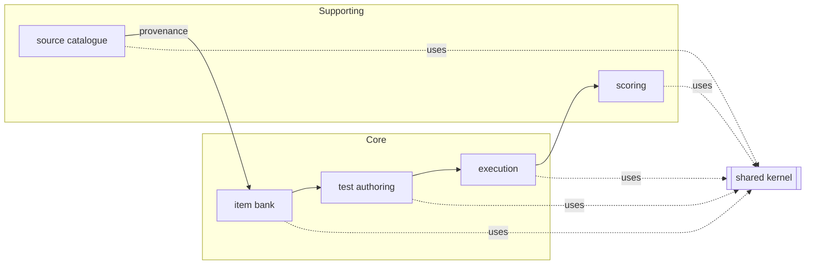
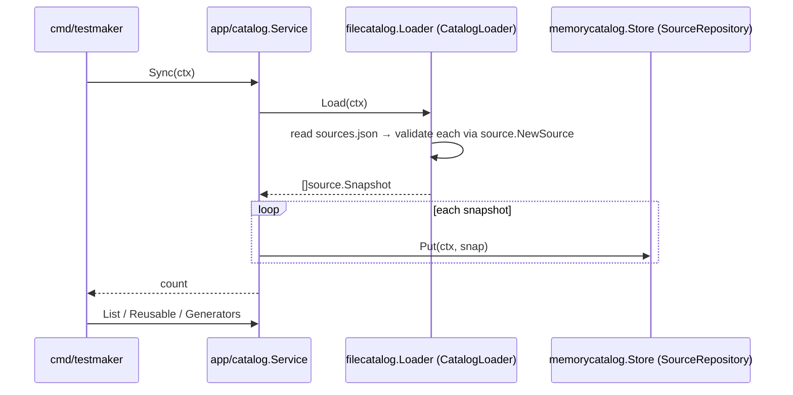
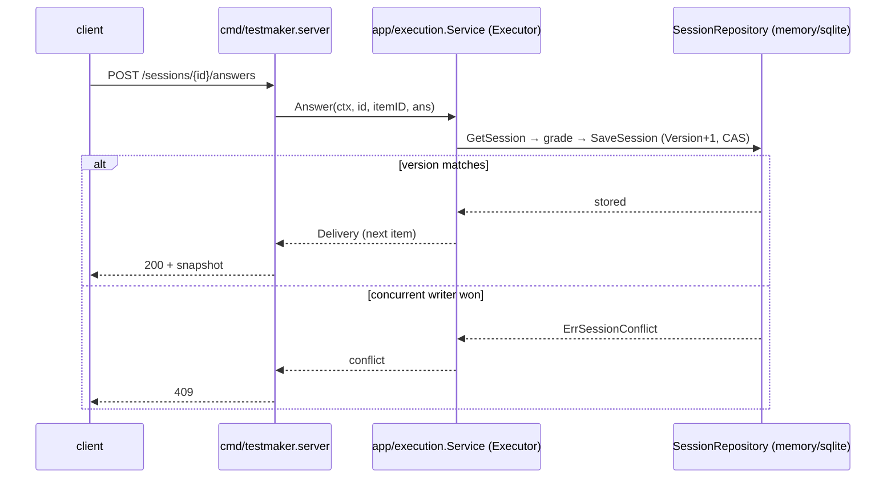

# Testmaker — Architecture

Authoritative system-design narrative. The **layering rules themselves are
enforced by [`.go-arch-lint.yml`](.go-arch-lint.yml)** — this document explains
them; that file is the source of truth. Ubiquitous terms are defined in
[UBIQUITOUS.md](UBIQUITOUS.md); the domain model in [DDD.md](DDD.md); the build
order in [IMPLEMENTATION_PLAN.md](IMPLEMENTATION_PLAN.md).

---

## 1. System Overview

Testmaker builds and administers cognitive-aptitude / IQ tests — logic-first
(figure series, matrices, Mensa-style figure reasoning, odd-one-out,
syllogisms), plus numerical, verbal, spatial and speed/working-memory families.
It is three cooperating subsystems over one shared item model:

| Subsystem | Responsibility |
| --- | --- |
| **Sourcing & item bank** | Catalogue external **sources**, **fetch** or **generate** items, normalize and store them in the **item bank** with provenance, license and difficulty. |
| **Designer / generator** | Author items by hand and **procedurally generate** them from rules; compose items into **tests** (sections, timing, fixed or adaptive delivery). |
| **Renderer / executor** | **Administer** a test (timing, navigation, adaptive item selection), capture responses, and **score** (raw, percentile band, IQ-scaled) with per-item feedback. |

Design goals: a pure, testable domain; swappable storage and fetch technologies;
speed and difficulty as first-class, machine-checked concepts; and a build where
architectural drift fails CI rather than review.

---

## 2. Architectural style — DDD + Hexagonal + Clean Architecture

Testmaker fuses three disciplines and makes their central rule mechanical:

- **Domain-Driven Design** — the code is partitioned into **bounded contexts**
  (source, item, testset, session, scoring) with a **shared kernel**
  (`domain/shared`). Each context owns its aggregates, value objects and
  invariants. Terms come from [UBIQUITOUS.md](UBIQUITOUS.md).
- **Hexagonal (ports & adapters)** — the application core talks to the outside
  world only through **ports** (interfaces in `ports/`). **Driven** ports are
  called by the core (repositories, catalogue loader, fetcher, generator);
  **driving** ports drive the core (executor, scorer). **Adapters** implement
  ports and live at the edge.
- **Clean Architecture** — dependencies point **inward only**. Concentric rings,
  innermost first: domain → ports → app → adapters → cmd.

### 2.1 Dependency rule

```
domain  <-  ports  <-  app  <-  adapters  <-  cmd
```

| Ring | Package(s) | May import | External deps |
| --- | --- | --- | --- |
| 1 Domain | `domain/**` | (only other `domain/**`) | **none** (stdlib only) |
| 2 Ports | `ports/**` | `domain` | none |
| 2 App | `app/**` | `domain`, `ports` | none |
| 3 Adapters | `adapters/<vendor>/<role>/<tech>` | `domain`, `ports` | that tech's SDK only |
| 4 Composition | `cmd/**` | anything | anything |

Adapters never import sibling adapters, app, or `cmd`. Each adapter is its own
lint component (and its own Go module), so a dependency in the sqlite adapter
can never leak into the memory adapter or the core.

### 2.2 Layer map (allowed edges)

```
          ┌─────────────────────────────────────────────┐
 Ring 4   │  cmd/testmaker   (composition root)          │  may use everything
          └───────────────┬─────────────────────────────┘
                          │ wires
          ┌───────────────▼─────────────────────────────┐
 Ring 3   │  adapters/native/source/{memorycatalog,      │  each: domain + ports
          │     filecatalog} · fetch/stubfetcher ·        │        (+ own vendor)
          │     llm/openaicompat · generate/rulegen · ... │
          └───────────────┬─────────────────────────────┘
                          │ implement
          ┌───────────────▼───────────────┐
 Ring 2   │  app/**  (use-cases)          │  domain + ports
          │  ports/** (interfaces)        │  domain
          └───────────────┬───────────────┘
                          │ depend on
          ┌───────────────▼───────────────┐
 Ring 1   │  domain/**  (pure model)      │  stdlib only
          └───────────────────────────────┘
```

`.golangci.yml`'s `depguard` mirrors the innermost edges at the file level so an
IDE flags a violation before `make arch-lint` runs.

---

## 3. Bounded contexts

| Context | Package | Kind | Purpose | Status |
| --- | --- | --- | --- | --- |
| Shared kernel | `domain/shared` | kernel | `TestmakerError`, sentinels, shared vocabulary | ✅ |
| **Source catalogue** | `domain/source` | core (supporting to sourcing) | where items come from: access class, license/redistributability, extraction | ✅ implemented |
| Item bank | `domain/item` | **core** | the scored items themselves (stem, options, key, difficulty, provenance) | ✅ implemented |
| Test authoring | `domain/testset` | core | composed tests: sections, timing, delivery policy | ✅ implemented |
| Test execution | `domain/session` | core | a live/completed attempt: navigation, timing, responses | ✅ implemented |
| Scoring | `domain/scoring` | supporting | raw → percentile band → IQ-scaled + feedback | ✅ implemented |

### Context map



The taxonomy (ability families + A1..E2 codes) and the inherited
`Redistributable` value live in `domain/shared`, promoted from `domain/source`
with the item-bank block; `domain/source` keeps type aliases so its public API
is unchanged (see [IMPLEMENTATION_PLAN.md](IMPLEMENTATION_PLAN.md)).

---

## 4. Ports (the hexagon boundary)

All interfaces live in `ports/` and cross data as domain **Snapshots**, never
aggregates.

| Port | Kind | Consumed/served by | Status |
| --- | --- | --- | --- |
| `SourceRepository` | driven | catalogue app service | ✅ |
| `CatalogLoader` | driven | ingest a catalogue file | ✅ |
| `Fetcher` | driven | pull raw items from a source | ✅ (stub + `httpfetch` direct-download) |
| `LLM` | driven | extraction / translation / derivation steps | ✅ (port; `openaicompat` backend ✅) |
| `PromptRepository` | driven | versioned prompt store for the LLM service | ✅ (port; `memoryprompts` + `fileprompts` ✅) |
| `ItemRepository` | driven | item bank | ✅ (memory + sqlite) |
| `TestRepository` | driven | "TestDb" — composed tests | ✅ (memory + sqlite) |
| `SessionRepository` | driven | execution | ✅ (memory + sqlite; rich JSON snapshot; **optimistic-concurrency CAS** on `SessionSnapshot.Version`) |
| `Generator` | driven | procedural item generation | ✅ (port; `rulegen` figural backend ✅) |
| `Executor` | driving | administer a test | ✅ (`app/execution.Service`) |
| `Scorer` | driving | score a completed session | ✅ (`app/scoring.Service`) |

Ports are kept small (`interfacebloat max: 6`) and split read/write when a
read-only consumer actually exists (YAGNI — the split is reintroduced with the
first query-only surface, e.g. Block 10).

LLM access is a **service, not a bare client**: `app/llm.Service` wraps a
`ports.LLM` backend and a `ports.PromptRepository`, automatically applying the
stored prompt for a step's `Purpose` and running registered
BeforeGenerate/AfterGenerate hooks around every call. The service itself
satisfies `ports.LLM`, so any consumer written against the port (ingestion
extraction, item translation, run-time item derivation) gets prompts + hooks
transparently via constructor injection from the composition root. See
[DESIGN.md](DESIGN.md#6-llm-support) §6 for hook
points, the prompt model and persistence tiers.

---

## 5. Adapters

Adapters are organized `adapters/<vendor>/<role>/<tech>`, each its own module and
lint component. Every storage port gets **paired implementations** validated by
one shared conformance suite (see [TESTS.md](TESTS.md)).

| Role | Tech | Package | Implements | Status |
| --- | --- | --- | --- | --- |
| source | memory | `adapters/native/source/memorycatalog` | `SourceRepository` | ✅ |
| source | file | `adapters/native/source/filecatalog` | `CatalogLoader` (JSON/YAML) | ✅ |
| fetch | stub | `adapters/native/fetch/stubfetcher` | `Fetcher` | ✅ |
| fetch | direct-download | `adapters/native/fetch/httpfetch` | `Fetcher` | ✅ |
| testdb | memory | `adapters/native/testdb/memorytestdb` | `TestRepository` + `ItemRepository` + `SessionRepository` | ✅ |
| testdb | sqlite | `adapters/native/testdb/sqlitetestdb` | `TestRepository` + `ItemRepository` + `SessionRepository` | ✅ |
| fetch | download/scrape/headless/generate | `adapters/native/fetch/*` | `Fetcher` | ✅ direct-download (`httpfetch`); scrape/headless/generate 🚧 |
| generate | rulegen (native figural) | `adapters/native/generate/rulegen` | `Generator` | ✅ figural (A1/A2/A3/A4); external engines not needed |
| llm | openaicompat | `adapters/native/llm/openaicompat` | `LLM` | ✅ |
| llm | bedrock | `adapters/aws/llm/bedrock` | `LLM` | 🚧 (optional) |
| llm | memory | `adapters/native/llm/memoryprompts` | `PromptRepository` | ✅ |
| llm | file | `adapters/native/llm/fileprompts` | `PromptRepository` (default) | ✅ |
| blob | memory | `adapters/native/blob/memoryblob` | `BlobStore` | ✅ |
| blob | fs | `adapters/native/blob/fsblob` | `BlobStore` | ✅ |
| blob | s3 | `adapters/aws/blob/s3blob` | `BlobStore` | 🚧 (later) |

One OpenAI-compatible HTTP adapter (stdlib `net/http` + `encoding/json`, no
vendor SDK) covers both cloud and local backends: OpenAI/Azure, and locally
Ollama (`/v1`), vLLM, LM Studio, llama.cpp server — they all speak the same
chat-completions API; only the base URL and key differ, which is composition-root
config. A native Ollama or Bedrock adapter is added only if a capability the
compat API lacks is actually needed (model pull management, AWS-credentialed
hosting).

Future cloud persistence (e.g. AWS DynamoDB via the AWS SDK v2) slots in as
`adapters/aws/testdb/...` — its own module, its own vendor allow-list.

---

## 6. The source-catalogue vertical slice (implemented)

The one end-to-end slice today. It demonstrates the full ring stack and is the
template every later component follows.



Key properties: the **loader** owns all wire-format (JSON/YAML) knowledge and
validates every record through `source.NewSource`, so only valid sources reach
the core; the **repository** stores and returns deep copies (no leaked internal
state); the **app service** holds no storage or parsing knowledge. Seed data is
the research catalogue at [`data/catalog/sources.json`](data/catalog).

---

## 7. Item & test model (item bank ✅; test ✅; session ✅)

The item bank normalizes everything into one **Item** aggregate:

- **Stem / stimulus** — text and/or figural media (image, SVG, matrix grid).
- **Answer format** — multiple-choice (4–6 options), open numeric, or
  true/false/cannot-say.
- **Answer key** + per-item **explanation** (shown after completion).
- **Difficulty** (1..N) and optional **norms** (item p-value / IRT parameters).
- **Provenance** — the `source.SourceID` and whether the item is fetched,
  generated, or authored, plus its redistributability (from the source license).

A **Test** composes items into ordered **Sections** with **timing** (global and
per-item) and a **DeliveryPolicy**: `fixed-increasing` (difficulty-ordered) or
`adaptive` (next item's difficulty depends on the previous answer). Composite
tests combine several families into timed sections (IST / PI style).

---

## 8. Test mechanics (requirements → design)

From [CLAUDE.md](CLAUDE.md), the mechanics the model must support:

| Requirement | Design placement |
| --- | --- |
| Item formats: MC 4–6, open numeric, T/F/cannot-say | `item` value objects (`AnswerFormat`) |
| Timing: strict global + per-item (e.g. 60 s/item, 6 min/section) | `testset` Section timing + `session` deadlines off an injected `domain/clock` |
| Difficulty: fixed increasing **and** adaptive | `testset.DeliveryPolicy`; `session` selects the next item, `app/execution` grades and drives |
| Composite tests (multi-family timed sections) | `testset` Sections |
| Scoring: raw, percentile/normal band, IQ-scaled | `scoring` context + `Scorer` driving port (`app/scoring.Service`) |
| Speed as a first-class scoring dimension | timing captured per item in `session`, consumed by `scoring` (`Speed` dimension) |
| Per-item explanations after completion | `item` explanation + `scoring` feedback |

Timing and adaptivity depend on a **clock** injected through `domain/clock`
(never `time.Now` directly — `forbidigo` enforces this): `clock.System()` is the
real reading in production and `clock.Fake` makes every attempt deterministic
under test. The `session` aggregate itself holds no clock — the executor passes
`now` into each transition.

---

## 9. Delivery surface (HTTP API) ✅

Authoring, execution and scoring are exposed over HTTP by
[`cmd/testmaker/server.go`](cmd/testmaker) (stdlib `net/http` only, the Go 1.22
method+path router), reached with `testmaker -serve <addr>`.

It lives in the **composition root, not a new adapter module**, on purpose: the
surface is the *driving* side of the hexagon and depends on the `app`
use-cases, and the layer graph forbids an adapter from importing `app`. `cmd` is
the one ring allowed to import everything, so it is where net/http meets the
use-cases. `openTestDB` is the single backend switch (memory default, sqlite
behind a DSN), shared by the CLI demo and the server.



Endpoints (whole author → take → score path): `POST /items/generate`,
`POST /tests`, `GET /tests/{id}`, `POST /tests/{id}/sessions`,
`POST /sessions/{id}/answers`, `POST /sessions/{id}/complete`,
`GET /sessions/{id}/score`. A single `shared.TestmakerError` → status map
(invalid→400, not_found→404, conflict→409, unavailable→503, unsupported→501,
else 500) is the only transport translation; request timing is expressed in
seconds so the wire format carries no clock types. Snapshots are marshalled
directly (no response-DTO layer). Norms are deployment config, so the server
runs with an empty norm book and returns raw scores + feedback.

**Optimistic concurrency.** `SessionRepository.SaveSession` is a compare-and-swap
on `SessionSnapshot.Version`: it stores only when the snapshot's version is
exactly one past the stored version, else it returns `session.ErrSessionConflict`
(→ 409). The version is a passthrough field on the `Session` aggregate (carried
through `Snapshot`/`RehydrateFromSnapshot`), incremented by the executor at each
persist. Concurrent `Answer`s — or an `Answer` racing a `Complete` — no longer
last-writer-win or resurrect a completed attempt: the first writer wins, the rest
get a conflict. Proven for both stores by the shared `ports/testdbtest`
conformance suite and end-to-end (under `-race`) by the delivery surface's
concurrent-answers-record-once test. In sqlite the swap is one guarded
conditional statement (`INSERT … ON CONFLICT DO NOTHING` / `UPDATE … WHERE
json_extract(snapshot,'$.Version') = ?`) that holds the write lock for its whole
duration, so a file database runs with WAL + `busy_timeout` + a real connection
pool and the guarantee holds across connections and processes sharing the file
(see ADR-0002). Client-supplied `If-Match`/ETags are a documented upgrade path;
today the server derives the expected version from its own load.

Architecturally significant decisions — this optimistic-concurrency guard and its
sqlite enforcement among them — are recorded as ADRs under
[docs/adr/](docs/adr/README.md).

---

## 10. Module layout

Multi-module `go.work` workspace. The root module holds the pure rings; each
adapter and the CLI are separate modules so technology dependencies stay at the
edge.

```
testmaker/
  go.work                       workspace (lists every module)
  go.mod                        github.com/mariotoffia/testmaker (domain, ports, app)
  domain/{shared,clock,source,prompt,item,testset,session,scoring}/
  ports/            + ports/{sourcetest,testdbtest,generatortest,blobtest,prompttest}/   (conformance suites)
  app/{catalog,ingest,llm,authoring,execution,scoring}/
  adapters/native/source/{memorycatalog,filecatalog}/   (own go.mod each)
  adapters/native/testdb/{memorytestdb,sqlitetestdb}/     (own go.mod each)
  adapters/native/fetch/{stubfetcher,httpfetch}/          (own go.mod each)
  adapters/native/blob/{memoryblob,fsblob}/              (own go.mod each)
  adapters/native/llm/{openaicompat,memoryprompts,fileprompts}/  (own go.mod each)
  adapters/native/generate/rulegen/                      (own go.mod)
  cmd/testmaker/                                          (own go.mod)
  data/catalog/sources.{json,yaml}                        seed catalogue
  data/prompts/*.yaml                                     seed LLM prompts (one per file)
  ARCHITECTURE.md DDD.md UBIQUITOUS.md DESIGN.md IMPLEMENTATION_PLAN.md
  DEVELOPMENT.md LINT.md TESTS.md AGENTS.md CLAUDE.md
  .go-arch-lint.yml .golangci.yml Makefile
```

---

## 11. Error model

One structured error type, `shared.TestmakerError{Code, Class, Message, Cause,
Context}`. Matching is by `Code` (so `errors.Is(err, source.ErrUnknownSource)`
works); fluent builders (`WithMessage`, `Wrap`, `With`) copy-on-write so
package-level sentinels stay immutable. Every context declares its own sentinels
beside its model (e.g. `source.ErrInvalidSource`, `source.ErrUnknownSource`).
`Class` (invalid / not_found / conflict / unavailable / unsupported) tells a
caller how to react.

---

## 12. Persistence

Storage is a driven-port concern. Each repository has a memory adapter (default,
dependency-free, used in tests) and — where durability matters — a **sqlite**
adapter (`modernc.org/sqlite`, pure-Go, no cgo), both validated by the same
conformance suite so they are provably interchangeable. The "TestDb" from
CLAUDE.md is `TestRepository` with `memorytestdb` + `sqlitetestdb`
implementations (implementation blocks 1–3).

---

## 13. Build, lint & CI

`make check` = `build` + `lint` + `test` (the CI aggregate), run in CI by
`.github/workflows/check.yml` on every push/PR. `lint` runs
`gofmt`, `go vet`, **`go-arch-lint`** (layer graph) and **`golangci-lint`** (v2).
See [DEVELOPMENT.md](DEVELOPMENT.md) and [LINT.md](LINT.md).

---

## 14. Status

Implemented end-to-end: the **source catalogue** slice (domain, ports, app,
memory + file adapters, stub fetcher, CLI) with the 81-source research catalogue
as seed data, the **designer / generator** slice (native figural rule engine,
authoring use-case, `-generate` CLI), the **test-authoring** slice
(`testset.Test` aggregate, `app/authoring.TestService` composing bank items into
composed timed tests, persisted via the memory + sqlite `TestRepository`,
`-author-test` CLI), and the **delivery surface** (`-serve` HTTP API over the
authoring / execution / scoring use-cases, with optimistic-concurrency-guarded
sessions). Remaining bounded contexts are scaffolding —
compiling package shells with `doc.go` and DTO stubs — filled in block by block.
[IMPLEMENTATION_PLAN.md](IMPLEMENTATION_PLAN.md) is the authoritative per-block
status; consult it rather than this paragraph for what is done.
