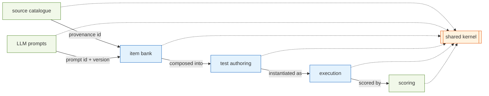
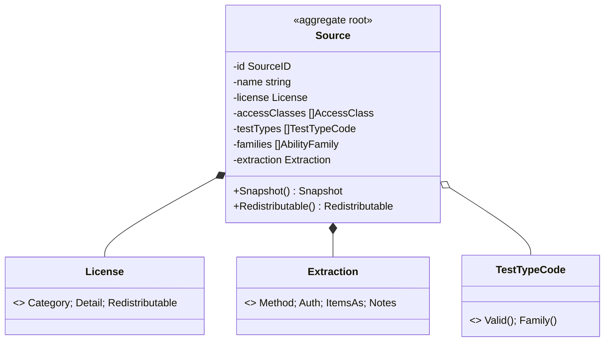

# Testmaker — Domain-Driven Design

Bounded contexts, aggregates and invariants. Layer rules live in
[ARCHITECTURE.md §2](ARCHITECTURE.md#2-architectural-style--ddd--hexagonal--clean-architecture);
term meanings in [UBIQUITOUS.md](UBIQUITOUS.md). **Source of truth for each
context is its `domain/<context>/doc.go`.**

---

## 1. Bounded contexts at a glance

| Context | Package | Subdomain | Purpose |
| --- | --- | --- | --- |
| Shared kernel | `domain/shared` | generic | error type, sentinels, cross-context vocabulary |
| Source catalogue | `domain/source` | supporting | where items come from; license & extraction |
| LLM prompts | `domain/prompt` | generic | stored, versioned Go-template prompts for LLM steps |
| Item bank | `domain/item` | **core** | the scored items |
| Test authoring | `domain/testset` | **core** | composed, timed, adaptive tests |
| Test execution | `domain/session` | **core** | a test-taking attempt |
| Scoring | `domain/scoring` | supporting | raw → band → IQ-scaled + feedback |

Implemented: **shared**, **clock**, **source**, **prompt**, **item**,
**testset**, **session** and **scoring**. Every bounded context now has a
working vertical slice.

**LLM assistance is a generic subdomain, not a core context.** The backend is
reached through the single driven port `ports.LLM`; the small `domain/prompt`
context owns the stored prompt templates (parse/render invariants only); the
`app/llm` service ties them together and runs hooks. Steps in any context
(ingestion extraction, translation, item derivation) receive the service by
injection; its output enters a context only through that context's
constructors (e.g. `item.NewItem`), like any other untrusted input.

---

## 2. Context map — who depends on whom

Contexts never import each other's internals; they reference each other only by
**id** (e.g. an item holds a `source.SourceID`, a test holds `item.ItemID`s).
Cross-context data moves as **Snapshots** through ports.

---

## 3. Aggregates

### 3.1 Source (`domain/source`) ✅ — aggregate root

**Invariants** (enforced by `NewSource`):

- `id` and `name` non-empty; at least one `URL`; at least one `AccessClass`.
- Every `AccessClass`, `TestTypeCode`, and the `License.Category` /
  `Redistributable`, `AnswerKeys`, `NormsDifficulty`, `Priority`, `IPRisk`,
  `Category`, and (if set) `Extraction.Method` are from their closed set.
- `Families` are **derived** from `TestTypes` — never accepted from input.

### 3.2 Item (`domain/item`) ✅ — aggregate root

Root `Item` with value objects `Stimulus`, `Option`, `AnswerKey`, `Difficulty`,
`Provenance`. Enforced invariants: multiple-choice items have 4–6 unique,
non-empty options and a key referencing an existing option; open-numeric items
have a numeric key and no options; true/false/cannot-say items have a verdict
key and no options; `Difficulty.Band >= 1`; at least one non-empty stimulus
part; `Provenance` (`SourceID` present, valid origin + redistributability). The
`AbilityFamily` is derived from `TestType`, never accepted from callers. See
[DESIGN.md §2](DESIGN.md#2-item-bank-).

### 3.3 Test (`domain/testset`) ✅ — aggregate root

Root `Test` composed of ordered `Section`s (value objects) with `Timing` and a
`DeliveryPolicy` (`fixed-increasing` | `adaptive`). Each section carries a
required ability `Family` and ordered `ItemRef`s (a plain-string item id plus its
difficulty band — the testset context never imports the item context). The
covered families are derived from the sections, never accepted from callers.
Invariants (`NewTest`): id/title non-empty; ≥1 section; each section a valid
family with ≥1 item; every item ref id non-empty and band ≥1; item ids unique
across the whole test; timing non-negative and coherent (a per-item cap never
exceeds its total budget); under `fixed-increasing` each section's refs are
non-decreasing by difficulty; under `adaptive` each section spans ≥2 difficulty
bands (a single-band pool cannot adapt). The aggregate crosses ports only as
`TestSnapshot`.

### 3.4 Session (`domain/session`) ✅ — aggregate root

Root `Session` is a clock-free state machine (`created → in-progress →
completed | abandoned`) holding `Response`s (with elapsed time + graded
correctness) and, for adaptive tests, the difficulty path taken. It carries its
own plan value objects (`PlanSection`/`PlanItem` — plain-string item ids +
`time.Duration` budgets), because a bounded context meets `testset`/`item` only
through the shared kernel. Enforced invariants: legal transitions only
(`Begin`/`Record`/`Complete`/`Abandon`); a response targets the presented item;
the clock never runs backwards (`now ≥ deliveredAt`). The aggregate holds no
clock — the executor (`app/execution`) owns time and passes `now time.Time` into
every transition, and grades answers against the item key before calling
`Record` (the session cannot import the item context). It crosses ports only as
the rich `SessionSnapshot` DTO, with every `time.Time` UTC-normalized so a memory
clone and a sqlite JSON round-trip are `reflect.DeepEqual`-identical.

### 3.5 Score (`domain/scoring`) ✅ — value result

`Score` value object: `Raw`/`Max`, `Ability` (adaptive), `Normed`,
`Percentile`, `ScaledIQ`, `Band`, `Speed`, and per-item `ItemFeedback`. Carries
no identity — produced by a `Scorer` from a completed `SessionSnapshot`. The
context also owns the norm model (`NormTable{Mean, SD}` normal norm + `NormBook`
by test id), the qualitative `Band` classification of a scaled IQ, and the
`AbilityFromStaircase` reversal-mean estimator that turns an adaptive outcome
sequence into an ability. It cannot import `session` or `item` (contexts meet
only through the shared kernel), so the application layer maps a
`session.Response` onto the context's `Outcome` value. Sentinel:
`ErrNotScorable` (session not completed).

### 3.6 Prompt (`domain/prompt`) ✅ — aggregate root

Root `Prompt{ID, Version, Purpose, Template, Params, Notes}` — a stored,
versioned Go `text/template` that the `app/llm` service auto-applies to the
step matching its `Purpose` (closed set: `extraction`, `translation`,
`derivation`, `generation`). Invariants: template parses on construction;
`Render(values)` fails on unresolved placeholders. Crosses ports as
`prompt.Snapshot` via `ports.PromptRepository`; `ID` + `Version` travel as
provenance on every LLM result.

---

## 4. Shared kernel (`domain/shared`)

`TestmakerError{Code, Class, Message, Cause, Context}` — the one domain error
type, matched by `Code`, with copy-on-write builders so sentinels stay immutable.
The ability-family / A1..E2 taxonomy (`AbilityFamily`, `TestTypeCode`,
`DeriveFamilies`) and the inherited `Redistributable` value live here, promoted
from `domain/source` with the item-bank block; `domain/source` keeps type
aliases so its callers are unchanged.

---

## 5. Invariant ownership

| Invariant | Owner | Enforced by |
| --- | --- | --- |
| Valid, closed-set source vocabulary | `source` | `NewSource` + `*.Valid()` |
| Families derived from test types | `shared` | `DeriveFamilies` (aliased by `source`) |
| Prompt templates parse; placeholders resolve | `prompt` | `NewPrompt` + `Render` (`missingkey=error`) |
| Redistributability preserved to items | `item` | `item.NewItem` provenance |
| MC items have 4–6 keyed options | `item` | `item.NewItem` |
| Legal session transitions | `session` | `Begin`/`Record`/`Complete`/`Abandon` guards |
| Response targets the presented item | `session` | `Record` (rejects a mismatched item id) |
| Monotonic timing (clock never rewinds) | `session` | transition guard on `now` vs `deliveredAt` |
| Deterministic timing (no hidden wall clock) | `domain/clock` + `app/execution` | injected `clock.Clock`; `forbidigo` bans `time.Now` |
| Answer graded against the item key | `app/execution` | `graded()` before `session.Record` |

---

## 6. Where to read more

- Model detail & mechanics: [DESIGN.md](DESIGN.md)
- Layering & ports: [ARCHITECTURE.md](ARCHITECTURE.md)
- Terms: [UBIQUITOUS.md](UBIQUITOUS.md)
- Build order: [IMPLEMENTATION_PLAN.md](IMPLEMENTATION_PLAN.md)
