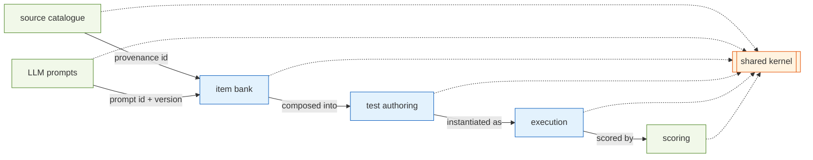
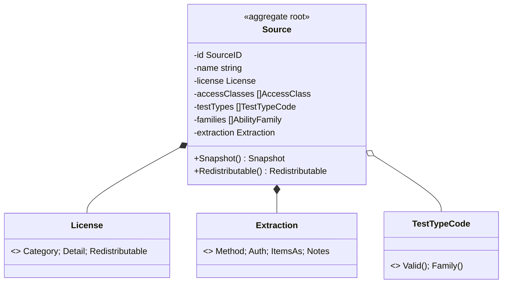

# Testmaker — Domain-Driven Design

Bounded contexts, aggregates and invariants. Layer rules live in
[ARCHITECTURE.md §2](ARCHITECTURE.md#2-architectural-style--ddd--hexagonal--clean-architecture);
term meanings in [UBIQUITOUS.md](UBIQUITOUS.md). **Source of truth for each
context is its `domain/<context>/doc.go`.**

---

## 1. Bounded contexts at a glance

| Context | Package | Subdomain | Purpose |
| --- | --- | --- | --- |
| Shared kernel | `domain/shared` | generic | error type, sentinels, cross-context vocabulary |
| Source catalogue | `domain/source` | supporting | where items come from; license & extraction |
| LLM prompts | `domain/prompt` | generic | stored, versioned Go-template prompts for LLM steps |
| Item bank | `domain/item` | **core** | the scored items |
| Test authoring | `domain/testset` | **core** | composed, timed, adaptive tests |
| Test execution | `domain/session` | **core** | a test-taking attempt |
| Scoring | `domain/scoring` | supporting | raw → band → IQ-scaled + feedback |

Only **source**, **prompt** and **shared** are implemented; the rest are
scaffold shells.

**LLM assistance is a generic subdomain, not a core context.** The backend is
reached through the single driven port `ports.LLM`; the small `domain/prompt`
context owns the stored prompt templates (parse/render invariants only); the
`app/llm` service ties them together and runs hooks. Steps in any context
(ingestion extraction, translation, item derivation) receive the service by
injection; its output enters a context only through that context's
constructors (e.g. `item.NewItem`), like any other untrusted input.

---

## 2. Context map — who depends on whom

Contexts never import each other's internals; they reference each other only by
**id** (e.g. an item holds a `source.SourceID`, a test holds `item.ItemID`s).
Cross-context data moves as **Snapshots** through ports.

---

## 3. Aggregates

### 3.1 Source (`domain/source`) ✅ — aggregate root

**Invariants** (enforced by `NewSource`):

- `id` and `name` non-empty; at least one `URL`; at least one `AccessClass`.
- Every `AccessClass`, `TestTypeCode`, and the `License.Category` /
  `Redistributable`, `AnswerKeys`, `NormsDifficulty`, `Priority`, `IPRisk`,
  `Category`, and (if set) `Extraction.Method` are from their closed set.
- `Families` are **derived** from `TestTypes` — never accepted from input.

### 3.2 Item (`domain/item`) 🚧 — aggregate root (designed)

Root `Item` with value objects `Stimulus`, `Option`, `AnswerKey`, `Difficulty`,
`Provenance`. Planned invariants: multiple-choice items have 4–6 options and a
key referencing an existing option; open-numeric items have a numeric key;
true/false/cannot-say items have a verdict key; `Difficulty` within range;
`Provenance.SourceID` present. See [DESIGN.md §2](DESIGN.md#2-item-bank-).

### 3.3 Test (`domain/testset`) 🚧 — aggregate root (designed)

Root `Test` composed of ordered `Section`s (value objects) with `Timing` and a
`DeliveryPolicy` (`fixed-increasing` | `adaptive`). Planned invariants: ≥1
section; each section ≥1 item; timing non-negative; adaptive sections require a
difficulty-tagged item pool.

### 3.4 Session (`domain/session`) 🚧 — aggregate root (designed)

Root `Session` as a state machine (`created → in_progress → completed |
abandoned`) holding `Response`s (with elapsed time) and the adaptive path.
Planned invariants: legal state transitions only; a response references a
delivered item; timing monotonic under the injected clock.

### 3.5 Score (`domain/scoring`) 🚧 — value result (designed)

`Score` value object: `Raw`, `Percentile`/band, `ScaledIQ`, plus per-item
feedback. Produced by a `Scorer`; carries no identity.

### 3.6 Prompt (`domain/prompt`) ✅ — aggregate root

Root `Prompt{ID, Version, Purpose, Template, Params, Notes}` — a stored,
versioned Go `text/template` that the `app/llm` service auto-applies to the
step matching its `Purpose` (closed set: `extraction`, `translation`,
`derivation`, `generation`). Invariants: template parses on construction;
`Render(values)` fails on unresolved placeholders. Crosses ports as
`prompt.Snapshot` via `ports.PromptRepository`; `ID` + `Version` travel as
provenance on every LLM result.

---

## 4. Shared kernel (`domain/shared`)

`TestmakerError{Code, Class, Message, Cause, Context}` — the one domain error
type, matched by `Code`, with copy-on-write builders so sentinels stay immutable.
The ability-family / A1..E2 taxonomy currently lives in `domain/source` and is
promoted here (or to `domain/taxonomy`) with the item-bank block.

---

## 5. Invariant ownership

| Invariant | Owner | Enforced by |
| --- | --- | --- |
| Valid, closed-set source vocabulary | `source` | `NewSource` + `*.Valid()` |
| Families derived from test types | `source` | `DeriveFamilies` |
| Prompt templates parse; placeholders resolve | `prompt` | `NewPrompt` + `Render` (`missingkey=error`) |
| Redistributability preserved to items | `item` (planned) | `item.NewItem` provenance |
| MC items have 4–6 keyed options | `item` (planned) | `item.NewItem` |
| Legal session transitions | `session` (planned) | state-machine methods |
| Deterministic timing | `session` (planned) | injected clock |

---

## 6. Where to read more

- Model detail & mechanics: [DESIGN.md](DESIGN.md)
- Layering & ports: [ARCHITECTURE.md](ARCHITECTURE.md)
- Terms: [UBIQUITOUS.md](UBIQUITOUS.md)
- Build order: [IMPLEMENTATION_PLAN.md](IMPLEMENTATION_PLAN.md)
