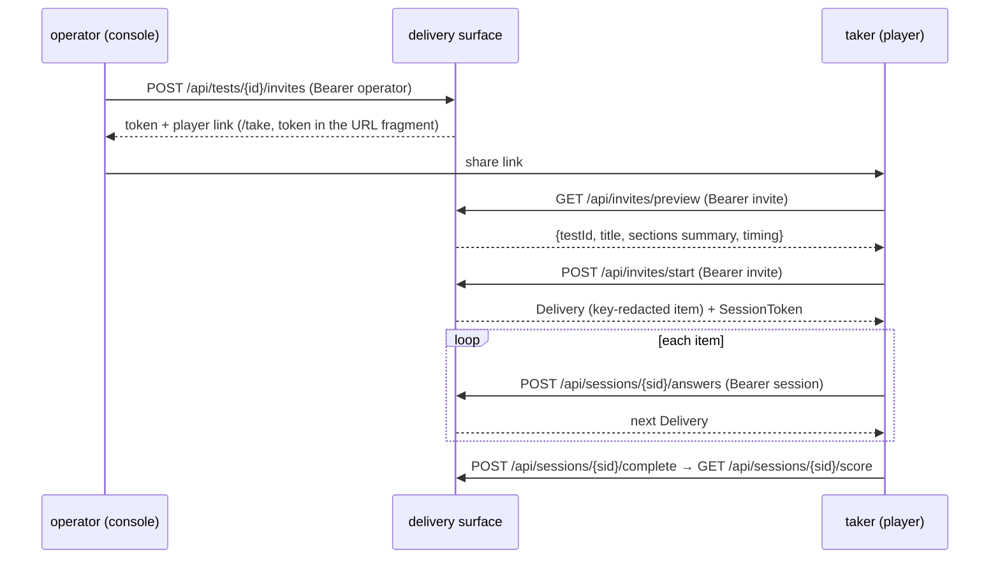

# Testmaker — Design Specification

Component- and model-level design. [ARCHITECTURE.md](ARCHITECTURE.md) covers the
ring structure and boundaries; this document covers **what each model holds, how
the flows work, and the design decisions** behind them, as they stand in the
implemented system. Future directions are in [ROADMAP.md](ROADMAP.md).

Legend: ✅ implemented · 🚧 planned (see [ROADMAP.md](ROADMAP.md)).

---

## 1. Source catalogue ✅

**Aggregate `source.Source`** — a catalogued place items come from. Validated on
construction (`NewSource`), crosses ports as `source.Snapshot`.

Fields: `ID`, `Name`, `Provider`, `URLs`, `AccessClasses`, `Formats`,
`License{Category, Detail, Redistributable}`, `TestTypes` (A1..E2),
`Families` (derived), `ItemCount`, `AnswerKeys`, `NormsDifficulty`, `Languages`,
`Extraction{Method, Auth, ItemsAs, Notes}`, `Generator`, `Priority`, `IPRisk`,
`Category`, `Notes`.

Design decisions:

- **Redistributability is the load-bearing field.** `License.Redistributable`
  (`yes` / `conditional` / `no`) gates whether a source's items may be reused or
  only mirrored as a format. The app service splits the sets: `Reusable()` is
  `yes` only (ingest as-is); `Conditional()` carries license terms (share-alike,
  attribution) that ingestion must record and honour per source. This encodes
  the central IP rule of the project directly in the model.
- **Families are derived, never trusted from input.** `DeriveFamilies` maps
  test-type codes to ability families, so the two can't drift.
- **Vocabulary is closed-set.** Every enum (`AccessClass`, `LicenseCategory`,
  `ExtractionMethod`, `ItemsAs`, …) validates against a fixed set; unknown
  values are rejected at ingestion, turning catalogue quality into a
  compile-time-ish guarantee.
- **`Extraction.Method` + `ItemsAs` drive fetch routing** (§5): they say *how* a
  Fetcher reaches the source and whether items arrive as text, images, grids,
  vectors or need a browser.

Seed data: the 81-source research catalogue at `data/catalog/sources.json`
(schema documented in `../Testmaker/catalog` research output).

---

## 2. Item bank ✅

**Aggregate `item.Item`** — one scored test item.

| Part | Design |
| --- | --- |
| `ID` | stable item id |
| `Provenance` | `SourceID` + origin (`fetched` / `generated` / `authored`) + inherited redistributability |
| `TestType` | A1..E2 taxonomy code (→ family) |
| `Stimulus` | ordered parts: text and/or media refs (image, SVG, matrix grid, figure) |
| `AnswerFormat` | `multiple-choice` (4–6 `Option`s) · `open-numeric` · `true-false-cannotsay` |
| `AnswerKey` | correct option id / numeric value (+ optional grading `Tolerance`) / verdict |
| `Explanation` | shown after completion |
| `Difficulty` | integer band (1..N); IRT `a/b/c` params deferred to psychometric calibration ([ROADMAP.md](ROADMAP.md) §4) |
| `Norms` | item p-value / response-time baseline deferred to psychometric calibration ([ROADMAP.md](ROADMAP.md) §4) |

Design decisions:

- **One aggregate for every family.** Figural, numerical, verbal and speed items
  share the same shape; the difference is `TestType`, `Stimulus` media and
  `AnswerFormat`. This keeps the bank, generator and renderer uniform.
- **Media by reference.** Figural items store media references (blob keys / URLs),
  not bytes; a separate blob store adapter resolves them ✅. Keeps the
  item aggregate small and serializable. The reference is a **content ref** (sha256
  of content-type + bytes) minted by `ports.BlobStore.Put`; the generator emits
  self-contained `data:` URIs and the composition root offloads them to refs when a
  store is wired, and the renderer resolves them back through the same port.
- **Provenance carries the license.** An item never loses the redistributability
  of its source, so export/publish paths can filter on it.
- **The taxonomy is promoted to a shared package.** It now lives in
  `domain/shared` (`AbilityFamily`, `TestTypeCode`, `DeriveFamilies`, and the
  inherited `Redistributable`), so `source`, `item` and `testset` share one
  definition of families and codes; `domain/source` keeps type aliases so its
  public API is unchanged.

---

## 3. Test authoring ✅

**Aggregate `testset.Test`** — a runnable assessment.

- **Sections** — ordered; each has a `Family`, an item selection (`ItemRef`s that
  carry the item id and its difficulty band), and timing.
- **Timing** — global limit and/or per-item limit; per-section limits (e.g. GIA
  6 min/section, adaptive Matrigma 60 s/item). Speed is modeled explicitly, not
  as an afterthought.
- **DeliveryPolicy** — `fixed-increasing` (present items in ascending difficulty)
  or `adaptive` (next item's difficulty is a function of prior correctness; an
  adaptive section must span at least two difficulty bands so it has room to
  adapt).
- **Composite** — a single test may combine families across sections (IST / PI
  style).

Design decision: delivery policy is data on the Test, not code in the renderer,
so the same executor runs fixed and adaptive tests by reading the policy.

The `app/authoring.TestService` composes a test from bank items: per section it
queries the bank (`ItemRepository`) by family/difficulty, orders matches by
ascending difficulty band and builds the `Test` through `NewTest` before
persisting the snapshot via `TestRepository`. A fixed-increasing test therefore
satisfies its non-decreasing-difficulty invariant by construction.

---

## 4. Execution & scoring — execution ✅ · scoring ✅ · delivery ✅

**Aggregate `session.Session`** ✅ — one attempt, a small clock-free state machine:

```
created → in-progress → completed
                     ↘ abandoned (timeout / cancel)
```

It records navigation state, the item currently presented, captured `Response`s
(chosen option / value + **elapsed time** + graded correctness), and — for
adaptive tests — the difficulty path taken. The aggregate holds no clock: the
executor owns time and passes a `now time.Time` into every transition
(`Begin`/`Record`/`Complete`/`Abandon`), so an attempt is deterministic under
test. The real reading comes from **`domain/clock.System()`** (`forbidigo` bans
raw `time.Now`); `clock.Fake` drives the tests.

The **`Executor`** driving port (`app/execution.Service`) drives the machine:
`Start` builds the session from a Test snapshot and presents the first item;
`Answer` grades the taker's answer against the item's key, records it and
presents the next item — for adaptive tests, the undelivered item whose band is
closest to a running target that climbs one band per correct answer and descends
one per wrong (a classical up/down staircase; IRT selection is deferred to
scoring). It abandons the attempt when the global budget is exhausted.
`Complete` finalizes. Attempt state lives only in the persisted
`SessionSnapshot` (a rich JSON blob in both testdb backends), so the service is
stateless and resumable. Grading is by answer format: option-id or verdict
equality, and for open-numeric `|answer − key| ≤ AnswerKey.Tolerance` (an
absolute epsilon, default 0 = exact); answer *presence* needs no flag because an
unanswered item is never recorded and `AnswerFormat` is the key's presence
discriminator.

**Scoring** (`scoring` context + `Scorer` **driving** port, backed by
`app/scoring.Service`) ✅ turns a completed session into:

- **Raw score** — the count of correct responses, read from the **frozen** grades
  captured at administration (`Response.Correct`), never re-graded against the
  live bank, so a score is reproducible and immune to later bank drift/deletion.
  The tradeoff is deliberate: a grade fixed at administration is *not* retroactively
  correctable — fixing a bad answer key means re-administering, not re-scoring — in
  exchange for a score that never silently changes under a taker after the fact.
  An attempt that answered nothing (a completed session with zero responses) has
  no data to norm and is rejected with `ErrNotScorable` rather than stamped with a
  confident low IQ. The raw denominator is the *answered* count (a power-test
  convention: unanswered = wrong is not assumed); a norm-derived score therefore
  assumes a full administration. On the normal executor path that holds — it
  presents every planned item in turn — but `Complete` does not *enforce*
  answered == planned, so a norm applied to a deliberately short attempt would
  over-state it; per-attempt norm selection is the upgrade path if partial
  administrations ever become a supported flow.
- **Percentile / normal-distribution band** — from a per-test **norm table**, a
  parametric normal model (`NormTable{Mean, SD}` of the scored dimension). The
  `NormBook` (test id → table) is provided at the composition root. A test with
  no norm scores raw-only (`Normed == false`, `Band == unnormed`).
- **IQ-style scaled score** (mean 100, SD 15): `IQ = round(100 + 15·z)`,
  `percentile = 100·Φ(z)` with `Φ` via `math.Erfc`.
- **Per-item feedback** (correct answer + explanation), read from the item bank
  in delivery order. An item removed since the attempt is not an error — the
  frozen grade already scored it, so its feedback text just degrades to blank.

The **scored dimension** is the raw count for a fixed-increasing attempt and the
**staircase ability estimate** for an adaptive one, so an adaptive score reflects
the delivery *path* taken, not just the count correct. Ability is the classical
transformed up/down estimator — the mean difficulty band at the **reversal
points** (direction changes correct↔wrong), which consumes the delivery order.

`Scorer` is a **driving** port (not driven): like `Executor` it orchestrates a
driven port — it reads the item bank to render feedback and resolves the norm
book — so it is a use-case, not a pure adapter. The psychometric math lives in
`domain/scoring`; the service only maps a `SessionSnapshot` onto that model.

Design decision: speed is reported as a first-class dimension (`Speed{Total,
Mean, CorrectPerMinute}`, exercised end-to-end by
`TestScoreFixedNormedWithFeedback`) but is not folded into the scaled IQ — a
speed-weighted composite needs a per-family speed norm no test carries yet.

The reported IQ and percentile are **clamped** to a defensible range
(`[40, 160]` and `[0.1, 99.9]`): a thin parametric norm extrapolated past ~±4 SD
produces figures ("IQ 210", "percentile 100.0") no fixed-form test can support,
so the tails are pinned rather than reported literally.

### Optimistic concurrency (SessionRepository) ✅

An attempt is a shared mutable resource the moment more than one request can
touch it — two `Answer`s for the same presented item, or an `Answer` racing a
`Complete`. A blind `SaveSession` upsert would let the last writer win and could
even resurrect a completed attempt. So `SessionRepository.SaveSession` is a
**compare-and-swap on `SessionSnapshot.Version`**: it stores only when the
snapshot's version is exactly one past the stored version, otherwise it returns
`session.ErrSessionConflict` (`ClassConflict`).

The version is modelled as a **passthrough field on the `Session` aggregate**
(never touched by a transition; carried through `Snapshot` /
`RehydrateFromSnapshot`) rather than store bookkeeping, because that is the
DDD-canonical home for an optimistic-lock token and it keeps the snapshot
round-trip (`Rehydrate(snap).Snapshot()`, which the memory store uses to
deep-copy) self-consistent. The executor increments it at each persist: `Start`
writes version 1, every later `Answer`/`Complete` writes `loaded+1`. Two writers
that both loaded version *v* both try to write *v+1*; the first wins, the second
conflicts. Version 0 is the never-persisted marker and cannot be stored directly.

This is enforced at the **store** (not the app), so it holds for every backend
and every driving surface, and is proven once by the shared `ports/testdbtest`
conformance suite (memory + sqlite) — both a sequential guard check and a
*contended* test that races N writers at one version and asserts exactly one
commits and the rest get `ErrSessionConflict`. In sqlite the version lives inside
the JSON snapshot blob (no new column/migration); the swap is one **guarded
conditional statement** — the first save is an `INSERT … ON CONFLICT DO NOTHING`
and every later save an `UPDATE … WHERE json_extract(snapshot,'$.Version') = ?`
on the prior version, with *zero rows changed* meaning conflict. A single
INSERT/UPDATE holds SQLite's write lock for its whole duration, so the check and
the write are atomic without a transaction and stay correct across a real
connection pool. A file database therefore runs with **WAL + `busy_timeout` + a
multi-connection pool** (a bare `:memory:` database keeps one connection, since
each connection would otherwise get its own private database). Client-supplied
`If-Match`/ETag propagation is the remaining upgrade path; today a driving surface
derives the expected version from its own load.

Because the guard lives in the statement rather than in a serialized connection,
the CAS is correct independent of how tightly any caller serializes — that is its
value as the **store's contract**. Within the single-process delivery surface
that ships, the CAS is rarely the mechanism that *rejects* a live HTTP race (the
executor's presented-item check usually fires first); its guarantee is the
forward insurance that lets the execution use-case be exposed to a multi-instance
/ multi-connection deployment (two `*Store` over one file, or two processes)
without a redesign. That is why the guard is proven at the store
(deterministically, under contention across a real pool) rather than only through
the surface.

### Delivery surface (HTTP) ✅

The whole pipeline is exposed over stdlib `net/http` (`cmd/testmaker -serve
<addr>`) so a user can catalogue, ingest, author, take and be scored through one
interface. It sits in the **composition root**, not a new adapter module: the
surface drives the `app` use-cases, and the layer graph forbids an adapter from
importing `app`. Endpoints map onto the use-cases — sourcing / ingest / bank
(`/sources`, `/sources/{id}`, `/catalog/sync`, `/items`, `/items/{id}`,
`/sources/{id}/ingest`, `/sources/{id}/ingest-llm`) and authoring → delivery
(`/items/generate`, `/tests`, `/tests/{id}`, `/tests/{id}/sessions`,
`/sessions/{id}/answers`, `/sessions/{id}/complete`, `/sessions/{id}/score`,
`/media/{ref}`); a single `shared.TestmakerError`-class → HTTP-status map is the
only transport translation, and request timing is carried in seconds so the wire
format stays clock-free. Domain snapshots are marshalled directly (no parallel
response-DTO layer), and norms — deployment configuration — default to empty, so
the API returns raw scores plus feedback until a deployment supplies a norm book.
The sourcing/ingest use-cases are wired into the server just as the CLI wires them
(each adapter bound to its port first, keeping the graph app → ports); the
deterministic ingest endpoints are synchronous, mirroring the CLI.

The surface carries **two roles** — operator and taker — enforced by
composition-root middleware (§7.3): the operator bank view (full
`item.ItemSnapshot`s, answer keys and all) and the ingest/generation verbs sit
behind the operator token, while a taker reaches only the session verbs of the
one attempt their capability token names. The session `Delivery.Item` handed
to a taker is additionally **key-redacted** — the executor strips `AnswerKey`
and `Explanation` from the presented item — so keys are protected by two
independent layers. The JSON surface lives under the `/api` prefix, with the
embedded web application (§7.1) served for every other path. The full surface
design, limits and job model are §7, all of it shipped and recorded
task-by-task in [PLAN.md](PLAN.md).

The server is **configuration-driven**: `testmaker -serve` reads its settings (db,
blob and catalogue/prompt locations, optional LLM backend) from a config file
created with defaults under `~/.testmaker` on first run, an explicit CLI flag
overriding the matching value. Mutable state and the seed catalogue/prompts
default to per-user paths under that home, never the working directory, so an
installed binary is self-contained (`make serve`).

---

## 5. Fetch & generation pipeline ✅ (`direct-download` / `scrape-html` / `api` fetchers + `app/ingest`; `generate` via `rulegen` + `app/authoring`; `headless-browser` / `git-clone` planned — [ROADMAP.md](ROADMAP.md) §3)

The `Fetcher` port pulls `RawItem`s from a source; a **router** selects the
concrete fetcher by `source.Extraction.Method` / `AccessClass`:

| Method / access | Fetcher adapter | Items arrive as |
| --- | --- | --- |
| `direct-download` | `adapters/native/fetch/httpfetch` (HTTP GET; zip/text) ✅ | one `RawItem` per file/zip member (text inlined, binary as media ref) |
| `scrape-html` | `adapters/native/fetch/scrapefetch` (HTTP GET; inline HTML) ✅ | text (figural = image refs) |
| `headless-browser` | browser driver (JS/interactive) 🚧 | images / interactive |
| `api` | `adapters/native/fetch/apifetch` (HTTP GET; JSON endpoints) ✅ | mixed |
| `git-clone` / `generate` | repo runner / **Generator** ✅ (`generate` via `rulegen`) | images / grids / vectors |
| `order-required` / `none` | not fetchable — catalogue only | — |

Fetched `RawItem`s are normalized into `item.Item`s (family, format, key,
difficulty, provenance) by the **`app/ingest`** use-case: it routes a source
`Snapshot` to the first `Fetcher` that `Supports` it, then hands the raw
material to a source-keyed **Normalizer** that emits `item.NewItem` specs.
The **openpsych-viqt** normalizer is the first real one — it parses the
codebook for keys and the response CSV for p-value difficulty bands, turning a
"pick the 2 synonyms among 5 words" vocabulary set into 4-option synonym
multiple-choice items. Two more normalizers land the scrape-html and api
branches end to end: the **asvab-official** normalizer scrapes the public-domain
official ASVAB sample subtests (`scrapefetch`), joining each question's visible
answer labels to the quiz's base64-encoded answer-key config to emit keyed
synonym (WK→C3), reading (PC→C1), and arithmetic (AR/MK→B2) multiple-choice
items; the **wikimedia-commons** parser reads MediaWiki `imageinfo` JSON
(`apifetch`) into licensed figure references (media only — no answer keys).
The **`Generator`** port is the generate branch, now
implemented by **`adapters/native/generate/rulegen`** ✅: a native Go rule
engine that emits figural items on demand (A1 figure-series, A2 matrix, A3 →
series, A4 odd-one-out) with ground-truth keys derived from the same rules that
build each stimulus, an honest effective difficulty band, and rule metadata in
the item `Explanation`. Figures render to self-contained SVG data-URIs — a
deliberate bridge so a generated item needs no external engine and no blob
store; with the blob store landed ✅, the composition root offloads
the data-URI to a content ref through `ports.BlobStore` and the item shape
(`MediaKind` + `MediaRef`) is unchanged. This resolves open question #299 toward
native rules rather than shelling out to Sandia SGMT / matRiks / RAVEN-family /
Bongard-LOGO. The **`app/authoring`** use-case stores a generated batch (offloading
inline media to the blob store when wired) and also exposes a manual `Author`
path onto the same item bank.

Design decision: fetchers return a loose `RawItem` (id, stem, media refs, raw
map) rather than a validated `Item`, keeping the messy edge out of the domain;
validation happens at normalization via `item.NewItem`. When a source's raw
material is unstructured (PDF text, scraped HTML), the normalization step may
call the `LLM` port (§6) with a JSON schema to lift it into item candidates —
which then pass `item.NewItem` like any other input.

---

## 6. LLM support ✅ <a name="6-llm-support"></a> (port + prompts + service ✅; `openaicompat` backend ✅; `memoryprompts`/`fileprompts` stores ✅; `app/ingest` extraction step ✅)

Three pieces, innermost-out:

1. **`ports.LLM`** ✅ — the backend boundary. One method:

   ```go
   type LLM interface {
       Generate(ctx context.Context, req LLMRequest) (LLMResponse, error)
   }
   ```

   `LLMRequest` carries the per-call knobs — `Model`, `Messages`, `MaxTokens`,
   `ContextLength`, `Temperature`, `Effort` (low/medium/high), and an optional
   `JSONSchema` for structured output. Zero values mean backend defaults; hints
   a backend cannot honour are ignored, never an error.

2. **`domain/prompt` + `ports.PromptRepository`** ✅ — prompts are data, not
   string literals in code. `prompt.Prompt{ID, Version, Purpose, Template,
   Params, Notes}` is a validated aggregate: the `Template` is a **Go
   `text/template`** (`{{.name}}` placeholders) that must parse on
   construction; `Render(values)` fails on missing placeholders
   (`missingkey=error`). `Purpose` is the closed set of auto-apply steps:
   `extraction`, `translation`, `derivation`, `generation` — a new purpose
   arrives with the block that consumes it. The repository resolves
   `ByPurpose` deterministically (highest `Version`, ties by smallest ID).

3. **`app/llm.Service`** ✅ — the library every step receives. It wraps the
   backend + prompt store and runs hooks around every call. It satisfies
   `ports.LLM` itself, so port-typed consumers get the full behaviour
   transparently.

### Hook points

| Hook point | Signature | When | Typical use |
| --- | --- | --- | --- |
| **Prompt application** | built into `GenerateFor(purpose, values, req)` | first — looks up `ByPurpose`, renders, prepends as system message | per-step system prompts, versioned + provenance-tracked |
| **BeforeGenerate** | `func(ctx, *LLMRequest) error` | before the backend, registration order | per-purpose model defaults, token/cost caps, PII redaction |
| **AfterGenerate** | `func(ctx, req, *Result) error` | after the backend, registration order | provenance recording (prompt id/version, model, tokens), JSON-shape validation, usage metering, cache write |

Order: prompt application → BeforeGenerate hooks (they see the final request)
→ backend → AfterGenerate hooks. Any hook error aborts the call; error policy
(retry, fallback to bank) stays with the caller. Hooks are registered **only
in the composition root** via functional options
(`llm.WithBeforeGenerate/WithAfterGenerate`); steps never register their own.
`Result` = `LLMResponse` + `PromptID`/`PromptVersion`, so provenance is
available to after-hooks and callers without a second lookup.

### Prompt persistence tiers

| Adapter | Backing | Use |
| --- | --- | --- |
| `adapters/native/llm/memoryprompts` ✅ | in-memory map | tests + conformance baseline |
| `adapters/native/llm/fileprompts` ✅ | one YAML per prompt under `data/prompts/` (`id`, `version`, `purpose`, `params`, `template`, `notes`); read/write | the default store — prompts are reviewable, diffable seed data |
| sqlite 🚧 ([ROADMAP.md](ROADMAP.md) §5) | table in the same database file | single-file deployments |
| `adapters/aws/llm/*` 🚧 | DynamoDB via AWS SDK v2 | cloud persistence, if/when wanted |

Both first adapters are validated by one `ports/prompttest` conformance suite
(the memorycatalog/filecatalog pattern). Response **caching** is a separate
later concern ([ROADMAP.md](ROADMAP.md) §5), not a persistence tier.

### Backends

One OpenAI-compatible HTTP adapter covers cloud (OpenAI, Azure)
and local (Ollama `/v1`, vLLM, LM Studio, llama.cpp server) — same wire API,
different base URL/key, chosen in the composition root. Optional later:
`adapters/aws/llm/bedrock` (AWS SDK v2) and a native Ollama adapter only if
model-management APIs are needed.

**`adapters/native/llm/openaicompat` ✅ — the buildable spec:**

- Stdlib only (`net/http`, `encoding/json`); arch component
  `adapter_llm_openaicompat` with `canUse: [_no_external_deps_]`.
- `New(cfg Config) (*Client, error)`. `Config`: `BaseURL` (required, e.g.
  `https://api.openai.com/v1` or `http://localhost:11434/v1`), `APIKey`
  (optional — local servers need none), `AuthScheme` (optional — zero value
  sends `Authorization: Bearer <key>`; `AuthSchemeAPIKey` sends Azure's
  `api-key: <key>` header), `HTTPClient *http.Client` (optional override;
  default has a sane timeout). Constructor validates, no lazy init.
- Request mapping to `POST {BaseURL}/chat/completions`: `Model`, `Messages`
  (roles as-is), `MaxTokens`, `Temperature` map directly, zero values
  omitted from the wire; `JSONSchema` → `response_format:
  {"type":"json_schema", …}`; `Effort` → `reasoning_effort`;
  `ContextLength` has no wire field — ignored silently (the port contract:
  hints are best-effort, never an error).
- Response mapping: first choice's message content; `model` as served;
  `usage` token counts, `0` when the backend omits usage.
- Errors: non-2xx and malformed bodies wrap into the adapter's
  `shared.TestmakerError` sentinels (matched by `Code` via `errors.Is`);
  response bodies read via `io.LimitReader` and always closed;
  `context.Context` cancellation honoured end-to-end.
- Wired in `cmd/testmaker` behind config — absent LLM config means the step
  is skipped, the CLI still runs.

### First consumer: LLM extraction (`app/ingest.IngestLLM`) ✅

The first step to consume the library. It fetches a source's unstructured
payload (the same `ports.Fetcher` path as deterministic ingest), sends it as a
user message under the stored `extraction`-purpose prompt
(`data/prompts/extract-items.yaml`, applied automatically by
`GenerateFor(PurposeExtraction, …)`) and the extraction JSON schema, then
decodes the completion into item candidates. Every candidate passes the same
`item.NewItem` gate as a normalizer's output — a candidate the model mis-shapes
(too few options, an `answer_index` referencing no option, an out-of-range
difficulty is clamped) is skipped, never stored unvalidated. Survivors are
tagged `item.OriginGenerated` with the source's redistributability; the
`Report` records the model and prompt provenance of the run. Malformed,
undecodable output is `ingest.ErrExtractParse`; a non-empty candidate set with
zero survivors is `ingest.ErrAllRejected` — the same fail-loud contract as
deterministic ingest. Unit tests drive it through a fake `ports.LLM` (canned
JSON); the CLI's `-ingest-llm` path and the `cmd/testmaker` integration tests
exercise it against a canned cloud endpoint and a real local Ollama backend
through the one `openaicompat` adapter.

Design rules:

- **LLM output is untrusted input.** Anything generated must pass the domain
  constructors (`item.NewItem`, key present, difficulty tagged) before it
  reaches a bank or an examinee; derivation failures fall back to the item
  bank — a session never blocks on a model.
- **Provenance is recorded.** LLM-lifted items are tagged `item.OriginGenerated`
  (a model transformation of the source text, not a verbatim source record), so
  psychometric calibration can treat them as unnormed. The run's model + prompt
  id/version are captured in the ingest `Report`, not (yet) as `item.Provenance`
  fields — no calibration consumer reads per-item model/prompt metadata yet, so
  those fields are deferred to the block that does (a documented `ponytail:`
  upgrade path on `app/ingest.IngestLLM`; decision recorded in
  [ADR-0004](docs/adr/0004-llm-extraction-provenance-in-report-not-item.md)).
  Extracted item ids are content-addressed (`{SourceID}-llm-{sha256(stem+options)[:12]}`)
  so re-extraction rewrites each candidate's own item instead of clobbering a
  positional neighbour.
- **Determinism in tests.** Unit tests use a fake `LLM` (canned responses);
  real backends are integration-only, consistent with the no-network rule in
  [TESTS.md](TESTS.md).
- **Injection, not construction.** Only `cmd/` builds the service and its
  backend; steps receive `ports.LLM` (usually the service). An adapter needing
  LLM help (e.g. the derivation generator) takes the port in its constructor —
  sibling adapters still never import each other; they meet only at the port.

---

## 7. Web application & delivery hardening ✅

The web UI and the hardening it presupposes, designed together
([ADR-0005](docs/adr/0005-embedded-spa-web-ui-served-from-composition-root.md) ·
[ADR-0006](docs/adr/0006-operator-token-and-hmac-capability-tokens.md) ·
[ADR-0007](docs/adr/0007-async-ingest-jobs-in-memory-at-delivery-surface.md)).
Everything in this section is composition-root work: **no new port, no domain
change** — the one domain-adjacent fact it relies on (an empty `Answer` records
as wrong) already holds. Implementation is **complete** — shipped task-by-task
per [PLAN.md](PLAN.md).

### 7.1 The web app: one SPA, two faces

**Stack.** Vite + React + TypeScript, built with **Bun**, styled with Tailwind;
data fetching via TanStack Query; routing via react-router. Source lives in
`web/` (not a Go module); `vite build` emits into `cmd/testmaker/webui/dist`,
which the tiny `webui` Go package embeds (`//go:embed all:dist`). A committed
`dist/.keep` keeps `go build` green without a UI build — the server then falls
back to the JSON index at `/`, so Bun stays optional for Go-only work.

**Serving.** Registered API patterns win over the `GET /` catch-all (Go 1.22
`ServeMux` precedence). The SPA handler serves the exact embedded file when it
exists (hashed `/assets/*` get `Cache-Control: immutable`), else `index.html`
(no-store) so client-side routes deep-link. The dev loop runs Vite's server
proxying `/api` to a locally running `testmaker -serve` (`make webui-dev`).

**Console** (operator face): dashboard (bank/catalogue/test counts), source
browser with per-source ingest + LLM-ingest actions and job progress, item-bank
browser (paginated, filtered, media previews via `/api/media/{ref}`, answer keys
visible — this face is operator-only), procedural generation form, test
composer (sections, families, difficulty ranges, timing, fixed/adaptive),
test list/detail, invite minting (copyable player link), job list.

**Player** (taker face): reads the invite from the URL fragment
(`/take#<token>` — fragments never reach server logs), shows the redacted test
preview (title, sections, counts, timing), then administers one item at a time:
stimulus parts (text and figural media), the three answer formats
(multiple-choice 4–6 options incl. figural options, open-numeric, true/false/
cannot-say), **global and per-item countdowns**, keyboard-first input (`1`–`6`
select, `Enter` submits, `T`/`F`/`C` verdicts), auto-submit of the current
selection when the per-item deadline lapses, and finally the score report (raw,
speed, percentile band / scaled IQ when normed, per-item feedback with
explanations).

**Wire conventions the TS client encodes once** (`web/src/api/types.ts`):
domain snapshots marshal **as-is** (PascalCase fields — `ID`, `TestID`,
`Presented`, …; the documented no-response-DTO decision), while request bodies
and cmd-local types (jobs, invites, page envelopes) are camelCase;
`time.Time` is RFC3339 (zero = `0001-01-01T00:00:00Z` = untimed);
`time.Duration` is **nanoseconds** on the wire.

### 7.2 API surface (`/api`)

| Endpoint | Role | Notes |
| --- | --- | --- |
| `GET /api` | public | service + endpoint index (was `GET /`) |
| `GET /api/auth/whoami` | public | resolves the presented bearer → `{role, …}`; the console/player login check |
| `GET /api/media/{ref}` | public | content-addressed capability refs; stimulus media only, never keys |
| `GET /api/sources`, `GET /api/sources/{id}` | operator | list is paginated + filtered |
| `POST /api/catalog` | operator | upload a catalogue JSON body: validate (`filecatalog.ParseJSON`) → atomic write to the configured catalogue path → `Sync` |
| `POST /api/catalog/sync` | operator | reload from the catalogue file |
| `GET /api/items`, `GET /api/items/{id}` | operator | full snapshots (keys); paginated + filtered |
| `POST /api/sources/{id}/ingest`, `…/ingest-llm` | operator | `"async": true` → `202` + job (§7.5); model/tokens clamped (§7.4) |
| `GET /api/jobs`, `GET /api/jobs/{id}` | operator | job registry, newest first |
| `POST /api/items/generate` | operator | unchanged semantics |
| `POST /api/tests`, `GET /api/tests`, `GET /api/tests/{id}` | operator | `GET /api/tests` is new (paginated) — the console's test list |
| `POST /api/tests/{id}/sessions` | operator | direct start (testing/ops); response includes the session token |
| `POST /api/tests/{id}/invites` | operator | mint `{token, url, expiresAt}` |
| `GET /api/invites/preview` | invite | redacted test summary (title, sections, counts, timing) — no item refs |
| `POST /api/invites/start` | invite | start a session for the invited test → `Delivery` + `SessionToken` |
| `POST /api/sessions/{id}/answers`, `…/complete`, `GET …/score` | session | session token for `{id}` (or operator) |

Collection endpoints return the **page envelope**
`{"items": […], "total": n, "limit": l, "offset": o}` (default limit 50, max
500), sorted by id (jobs: newest first) so pages are stable. Pagination is
applied at the handler over the repository list — honest at single-node scale;
pushing `Limit`/`Offset` into the repository ports is deliberately deferred to
cloud persistence ([ROADMAP.md](ROADMAP.md) §2), where a store can page
natively.

### 7.3 Access control

Stateless, single-tenant, three tokens
([ADR-0006](docs/adr/0006-operator-token-and-hmac-capability-tokens.md)):

- **Operator token** — random 256-bit bearer in `auth.operatorToken`.
- **Invite** — `ti.<b64url(JSON{tid,exp})>.<b64url(HMAC-SHA256(secret, "ti."+payload))>`;
  minted per test, TTL from `auth.inviteTTLSeconds` (request may shorten);
  grants preview + start for `tid`. Stateless ⇒ not single-use (documented
  ceiling; an invite store is the upgrade).
- **Session token** — `ts.<b64url(JSON{sid})>.<sig>`, returned by
  `invites/start` (and `tests/{id}/sessions`); authorizes exactly session
  `sid`'s verbs. No expiry of its own — the session lifecycle (global deadline,
  completion) already bounds it.



`auth.mode: none` disables enforcement (trusted localhost / most tests).
Verification is constant-time; auth failures are transport-native
(`401`/`403`, `code: auth.required | auth.forbidden`) rather than
`TestmakerError`s — the domain's closed `Class` vocabulary is not stretched to
transport concerns. The same rule keeps `429` (limits) middleware-native.

### 7.4 Limits

- **Per-IP rate limit** on `/api` (token bucket, `limits.requestsPerSecond` /
  `limits.burst`, default 10/20) → `429`. Buckets are pruned; the keying
  assumes direct connections (a trusted-proxy header option is a documented
  later knob).
- **Ingest semaphore** — `limits.maxConcurrentIngests` (default 1) gates sync
  and async runs alike; a sync request that cannot acquire it gets `429`, an
  async job queues.
- **LLM clamp** — a `BeforeGenerate` hook registered at the composition root
  (the LLM service's designed hook point, §6): `MaxTokens` capped to
  `llm.maxTokensCap` (default 4096) and, when `llm.allowedModels` is non-empty,
  unknown models rejected as `invalid` → 400. Caller-controlled spend is
  bounded server-side no matter what the request says.
- The 1 MiB request-body cap already ships; `POST /api/catalog` alone allows
  4 MiB (a full catalogue upload).

### 7.5 Jobs (async ingest)

In-memory registry in `cmd` ([ADR-0007](docs/adr/0007-async-ingest-jobs-in-memory-at-delivery-surface.md)):
`{id, kind: ingest|ingest-llm, sourceId, state: queued→running→done|failed,
report?, error?, createdAt/startedAt/endedAt}`. `"async": true` on an ingest
request returns `202` + the job; the run executes on a background context with
`limits.ingestTimeoutSeconds`; the console polls. Bounded (oldest completed
pruned), clock-injected (`domain/clock`) so lifecycles are deterministic under
test, lost on restart by design — the durable outcome is the item bank and the
report the run already persists through its own path.

### 7.6 Observability & error hygiene

Structured logging via `log/slog` (level from `log.level`): a request-log
middleware (method, path, status, duration, remote IP) and full error detail
at the log — while the wire body carries only
`{"error": <safe message>, "code": <TestmakerError code>, "class": <class>}`.
Unclassified errors become a generic `500 internal error` body; cause chains
(paths, backend URLs) stop echoing to clients. Non-media responses gain
baseline security headers; the SPA gets a same-origin CSP; `GET /api/media/…`
keeps its stricter sandboxed CSP (ADR-0003).

### 7.7 Configuration additions

`config.json` gains `auth` (mode, operatorToken, secret, inviteTTLSeconds),
`limits` (requestsPerSecond, burst, maxConcurrentIngests,
ingestTimeoutSeconds), `log` (level) and the LLM clamp fields (maxTokensCap,
allowedModels). Loading applies defaults to absent fields (existing files keep
working) and **generates + persists** the operator token and secret on first
run in `token` mode — the file is already 0600 for the LLM key. `-auth` joins
the flag-overrides-config set.

### 7.8 Player timing model

The executor stays the enforcement point (global budget server-side; per-item
deadline advisory). The player renders `Delivery.Deadline` (per-item) and
`StartedAt + Timing.Total` (global) as countdowns, correcting client skew from
the response `Date` header; at a lapsed per-item deadline it **auto-submits
the current selection** — an empty `Answer{}` is recordable and grades wrong,
so a timed-out item counts as answered-wrong (the strict speeded convention)
and the attempt advances without a "skip" verb the domain doesn't have.

## 8. Cross-cutting design rules

- **Snapshots at boundaries.** Aggregates never cross a port; a `Snapshot` DTO
  does. Adapters store/return deep copies so internal state can't leak.
- **Constructors validate; rehydration trusts.** `New…` enforces invariants and
  returns `*shared.TestmakerError`; `RehydrateFromSnapshot` skips validation for
  data already known-good.
- **Determinism.** Randomness (generation, item order) and time (timing,
  adaptivity) are injected, so tests are reproducible.
- **Conformance suites define behaviour.** A repository's contract is the
  `…test.Run…Tests` suite, run against every adapter (see [TESTS.md](TESTS.md)).

---

## 9. Design decisions of record

The forks taken along the way — optimistic-concurrency CAS on the session store,
the content-addressed blob store and media offload, and LLM-extraction provenance
in the ingest report rather than on the item — are captured as dated decision
records under [docs/adr/](docs/adr/README.md). Deferred directions (IRT
calibration, durable/empirical norms, LLM caching and eval) live in
[ROADMAP.md](ROADMAP.md).
