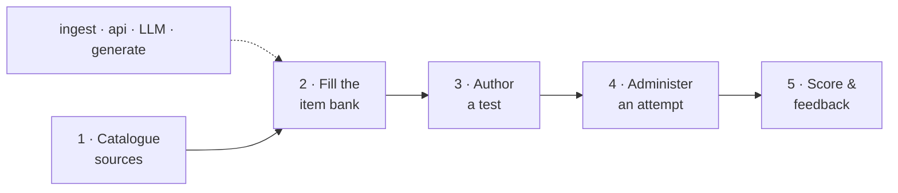

# testmaker

Build and administer cognitive-aptitude / IQ tests — logic-first (figure series,
matrices, Mensa-style figure reasoning, odd-one-out, syllogisms) plus numerical,
verbal, spatial and speed families. Testmaker catalogues **sources** of items,
**fetches or generates** them into an **item bank**, composes them into timed,
optionally adaptive **tests**, and **administers and scores** them.

Go 1.25 · multi-module `go.work` · DDD + Hexagonal + Clean Architecture, with the
layer graph enforced in CI by [`go-arch-lint`](.go-arch-lint.yml).

## Status

The whole pipeline is implemented end-to-end — cataloguing sources, fetching /
generating items into the bank, composing timed (fixed or adaptive) tests, and
administering + scoring attempts — driven by a CLI demo and exposed as an HTTP
API. Storage runs on in-memory or sqlite backends (proven interchangeable by
shared conformance suites), seeded with an 81-source research catalogue.

The **web app** is available — an embedded operator console + test player SPA
with the delivery-surface hardening it requires (roles/auth, rate + cost limits,
pagination, async ingest jobs). Run it with `make serve-all` (builds the SPA,
then serves the single binary on `:8080`). Its design is in
[DESIGN.md §7](DESIGN.md). [ROADMAP.md](ROADMAP.md) holds the deferred directions
(cloud persistence, IRT calibration, the remaining fetchers, LLM hardening).

## Documentation

| Document | What it covers |
| --- | --- |
| [ARCHITECTURE.md](ARCHITECTURE.md) | System design: rings, bounded contexts, ports/adapters, mechanics |
| [DESIGN.md](DESIGN.md) | Model- and flow-level design decisions |
| [DDD.md](DDD.md) | Bounded contexts, aggregates, invariants, context map |
| [UBIQUITOUS.md](UBIQUITOUS.md) | Authoritative glossary |
| [PLAN.md](PLAN.md) | Step-by-step implementation plan for the web app + hardening initiative |
| [ROADMAP.md](ROADMAP.md) | Future directions and deferred work |
| [DEVELOPMENT.md](DEVELOPMENT.md) | Setup, build, adding modules, conventions |
| [LINT.md](LINT.md) | What the linters enforce and how |
| [TESTS.md](TESTS.md) | Test strategy + the conformance-suite pattern |
| [AGENTS.md](AGENTS.md) | Navigation for AI agents (task → doc) |
| [CLAUDE.md](CLAUDE.md) | Project mission, scope and test taxonomy |

## Project structure

```
domain/            pure model (stdlib only) — shared, clock, source, prompt, item, testset, session, scoring
ports/             interfaces (the hexagon boundary) + conformance suites
app/               use-cases — catalog, ingest, llm, authoring, execution, scoring
adapters/native/   edge implementations, one module each
  source/{memorycatalog,filecatalog}                  in-memory repo + JSON/YAML loader
  testdb/{memorytestdb,sqlitetestdb}                  item / test / session repositories
  fetch/{stubfetcher,httpfetch,scrapefetch,apifetch}  Fetcher adapters (download / scrape / api)
  blob/{memoryblob,fsblob}                            figural-media store
  llm/{openaicompat,memoryprompts,fileprompts}        LLM backend + prompt stores
  generate/rulegen                                    native figural generator
cmd/testmaker/     composition root (CLI demo + HTTP API + webui/ go:embed package)
web/               web app source (Bun + Vite + React + TS) → builds into cmd/testmaker/webui/dist
data/catalog/      seed source catalogue (sources.json / .yaml)
data/prompts/      seed LLM prompts (one YAML per prompt)
```

## Quick start

```bash
make install     # golangci-lint + go-arch-lint (pinned versions)
make check       # build + lint (gofmt, vet, go-arch-lint, golangci) + unit tests
go run ./cmd/testmaker --catalog data/catalog/sources.json   # the CLI demo
make serve       # install + run the HTTP API (config + data under ~/.testmaker)
make serve-all   # build the web app (requires bun), then serve the single binary
```

That bare command loads the catalogue into the in-memory repository and reports
source counts by category plus the reusable / conditional / generator split. Each
later stage of the pipeline is switched on by a flag — see the workflow below.

## Workflow — from gathering items to running a test

One pipeline runs from cataloguing sources to scoring a taker's attempt. The
`testmaker` CLI walks each stage (each gated by a flag) as a demo; `-serve`
exposes the whole pipeline as an HTTP API (the same stages, over HTTP).
(`testmaker` below is the built binary, or `go run ./cmd/testmaker`.) For the demo,
storage is chosen with `-testdb memory|<sqlite-dsn>` and `-blobs memory|<dir>`; the
**server** is config-driven — `make serve` installs the binary and runs it against
a config file created under `~/.testmaker` on first run (settings + data live
there, never the working directory).



**1 · Catalogue the sources** — where items may come from (license, access,
extraction method). The seed catalogue holds 81 researched sources.

```bash
testmaker -catalog data/catalog/sources.json
```

**2 · Fill the item bank** — four ways, mixed as needed. Whatever the origin,
every item is validated by the domain constructor before it is stored.

```bash
testmaker -ingest openpsych-viqt       # deterministic fetch + normalize (direct-download)
testmaker -ingest asvab-official       # deterministic fetch + normalize (scrape-html)
testmaker -fetch-api wikimedia-commons # preview licensed figure media (api; media-only)
testmaker -generate A2                 # procedurally generate figural items (rulegen)
TESTMAKER_LLM_BASE_URL=http://localhost:11434/v1 \
  testmaker -ingest-llm <source-id>    # lift an unstructured payload with an LLM
```

**3 · Author a test** — compose bank items into a composite, timed,
difficulty-ordered test (sections, per-item / per-section timing, fixed or
adaptive delivery), persisted to the TestDb.

```bash
testmaker -author-test
```

**4 · Administer an attempt** — run a test under timing, grading each answer.

```bash
testmaker -run-test      # CLI demo: drives a fixed and an adaptive attempt
testmaker -serve :8080   # or expose the HTTP API for real takers
```

The same stages are available over HTTP (`-serve`), all under `/api`
([DESIGN.md §7.2](DESIGN.md) is the authoritative table, with roles):

```
GET  /api                                                            service + endpoint index
GET  /api/auth/whoami                                                resolve the bearer token → role
GET  /api/sources[?generators=&family=&...&limit=&offset=]           list the catalogue (operator)
GET  /api/sources/{id}                                               one source (operator)
POST /api/catalog                                                    upload a catalogue body (operator)
POST /api/catalog/sync                                               reload the catalogue file (operator)
POST /api/sources/{id}/ingest[-llm]                                  fetch/extract items ("async":true → 202 + job)
GET  /api/jobs[/{id}]                                                async ingest job progress (operator)
GET  /api/items[?family=&...&limit=&offset=]                         query the item bank, keys included (operator)
GET  /api/items/{id}                                                 one item (operator)
POST /api/items/generate                                             generate items into the bank (operator)
POST /api/tests · GET /api/tests[/{id}]                              compose / list / inspect tests (operator)
POST /api/tests/{id}/invites                                         mint a taker invite link (operator)
GET  /api/invites/preview · POST /api/invites/start                  preview / start the invited test (invite token)
POST /api/sessions/{id}/answers                                      answer the presented item (session token)
POST /api/sessions/{id}/complete                                     finish the attempt (session token)
GET  /api/sessions/{id}/score                                        raw + band + IQ + speed + feedback (session token)
GET  /api/media/{ref}                                                resolve a figural-media blob (public, content-addressed)
```

Everything outside `/api` serves the embedded **web app** — the operator
console and the test player ([DESIGN.md §7.1](DESIGN.md)). Without a UI build,
`/` falls back to the JSON index.

**5 · Score & feedback** — the completed attempt yields a raw score, a percentile
/ IQ band from the deployment's norm book (raw-only when a test carries no norm),
a first-class speed dimension, and per-item explanations.

> **API posture.** Two roles guard the surface: the **operator** (static bearer
> token, generated into the config on first run) owns the catalogue, the bank
> (answer keys) and composition; a **taker** holds only HMAC capability tokens —
> an expiring invite for one test, then a token for their one session — and the
> item they see is answer-key-redacted by the executor on top of that. Rate
> limits, an ingest-concurrency gate and server-side LLM clamps bound the cost
> of the mutating verbs; `auth.mode: none` restores the open localhost surface
> for development ([DESIGN.md §7](DESIGN.md), [ADR-0006](docs/adr/0006-operator-token-and-hmac-capability-tokens.md)).

## Development

Dependencies point inward only: `domain ← ports ← app ← adapters ← cmd`. Each
adapter is its own module and lint component. See [DEVELOPMENT.md](DEVELOPMENT.md)
and [LINT.md](LINT.md).

## License

See [LICENSE](LICENSE).
