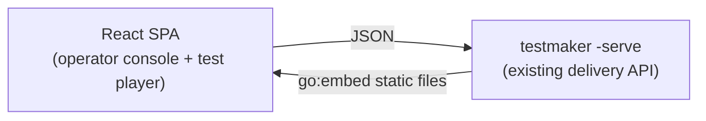
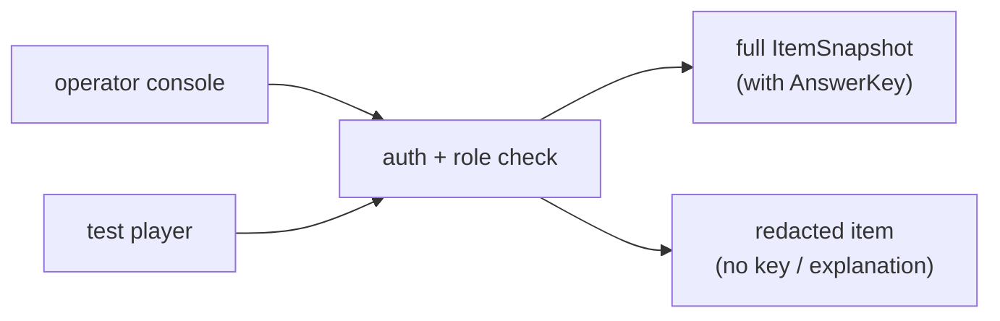
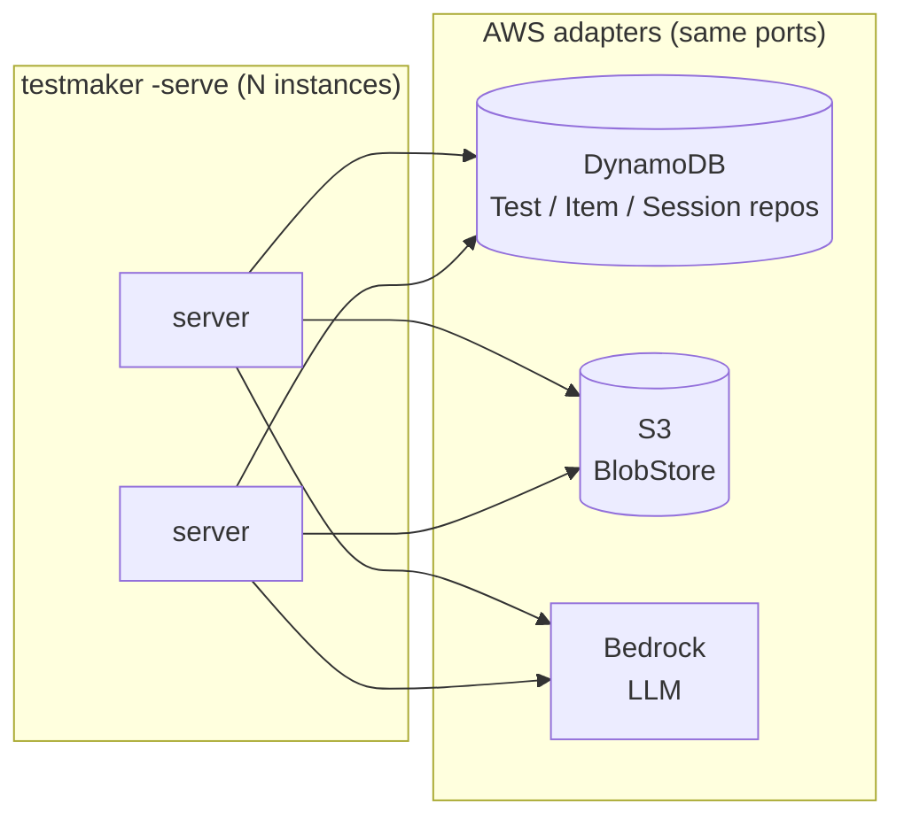
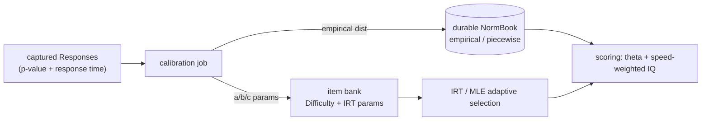

# Testmaker — Roadmap

Future directions, one chapter per initiative. Everything here is **deferred, not
designed-in**: the shipped system runs end-to-end without any of it (see
[DESIGN.md](DESIGN.md) for what exists today). Each item states what it is, why it
is wanted, and how it would be built against the current ports so nothing here
needs a redesign to land — only a new adapter or a swapped algorithm behind an
existing seam.

**§1 is the recommended immediate next step** — a web UI over the delivery
API, with the surface hardening (authentication, rate/cost limits) it
requires as a built-in precondition. The rest are ordered by dependency: an
item lower in the list generally assumes the ports and data from the ones
above are in place.

---

## 1. Web UI (operator console + test player)

**Status:** the whole pipeline is exposed over HTTP (`testmaker -serve`) —
cataloguing, ingesting, filling, authoring, administering and scoring all have
endpoints ([DESIGN.md](DESIGN.md) §4, [ARCHITECTURE.md](ARCHITECTURE.md) §9) —
but it is **JSON-only**: `GET /` returns an endpoint index, nothing renders in a
browser. This item puts a real web application on top of that API.

**What.** One web app with two faces, both driven entirely by the existing
delivery API:

- **Operator console** — the authoring/administration side:
  - browse the source catalogue (`GET /sources`), inspect a source, trigger
    ingest and LLM ingest with progress/result feedback;
  - browse and search the item bank (`GET /items`), preview any item the way a
    taker would see it — including figural stems/options rendered from
    `GET /media/{ref}`;
  - generate items (`POST /items/generate`) and compose tests
    (`POST /tests`): pick families, counts, timing policy (fixed order vs
    adaptive), section layout.
- **Test player** — the taker side, and the reason this is an app rather than a
  set of forms:
  - start a session, present one item at a time with the **global and
    per-item countdown timers** the domain already enforces (e.g. adaptive
    60 s/item), rendering figural items (matrices, series) as images/SVG;
  - answer capture for all three item formats (multiple choice 4–6 options,
    open numeric, true/false/cannot-say), keyboard-first navigation — speeded
    tests live or die on input latency;
  - complete → score report: raw score, percentile band, IQ-style scaled
    score, per-item review with explanations (`GET /sessions/{id}/score`).

**Tech strategy.** **Vite + React + TypeScript SPA, built with Bun, embedded
into the Go binary via `go:embed`** — the server gains one static-file route;
deployment stays a single binary with no Node/Bun at runtime. Rationale:

- **The test player is genuinely client-heavy.** Millisecond-visible countdown
  timers, per-item deadlines, instant answer feedback in adaptive mode, and
  keyboard-driven speeded navigation are client-state problems. Server-rendered
  Go templates + htmx handle CRUD consoles well but are the wrong tool for a
  strictly-speeded test player — the htmx camp itself concedes the
  client-heavy, real-time case to SPAs
  ([Go/templ/htmx overview](https://medium.com/@iamsiddharths/building-reactive-uis-with-go-templ-and-htmx-a-simpler-path-beyond-spas-17e7dad2c7a2)).
- **LLM-assisted development is materially better in React/TS.** The training
  corpus for React/TypeScript dwarfs Go templating; practitioners report LLMs
  are "very good" with React precisely because of example volume, while the
  Go+templates+htmx experience is "serviceable, but much less smooth" — models
  fall back to emitting walls of plain HTML instead of reusing components
  ([six months with the GoTH stack](https://thefridaydeploy.substack.com/p/my-6-months-with-the-goth-stack-building),
  [why TypeScript for LLM-based coding](https://medium.com/@tl_99311/why-i-choose-typescript-for-llm-based-coding-19cbb19f3fa2)).
  Since this repo is largely LLM-built, that quality gap is a first-order
  input, not a taste question.
- **Architecture fit.** The SPA is just another client of the JSON port — a
  delivery adapter concern. Nothing inward of `cmd` changes; the Go side only
  adds `go:embed` + a fallback route next to the existing mux.

Pure-Go alternative (templ/htmx) is acknowledged and rejected for the player;
it would be acceptable for the operator console alone, but splitting the app
across two UI stacks is worse than one SPA.

### Precondition: delivery-surface hardening (auth, limits)

The API ships **unauthenticated and single-tenant by design**, and the same
mux serves both operator and taker. Before the UI is exposed beyond a trusted
localhost operator, the surface must be hardened — all at the composition root
(middleware around the mux, no domain change):

- **Auth + roles.** `item.ItemSnapshot` carries `AnswerKey`/`Explanation`; the
  taker's session `Delivery.Item` is already key-redacted, but the operator
  bank view (`GET /items*`) returns full snapshots — it must sit behind an
  operator credential, with session verbs open to an authenticated taker. The
  UI's two faces map 1:1 onto these two roles.

- **Rate + cost limits.** `POST /sources/{id}/ingest[-llm]` triggers outbound
  fetches and paid LLM calls whose `model`/`maxTokens` the caller controls —
  add a request limiter on mutating POSTs and a server-side clamp on LLM
  parameters (overlaps §5). A request-body cap already ships.
- **Pagination** — `limit`/`offset` on `GET /items` and `GET /sources`, which
  the console's bank browser needs anyway.
- **Error hygiene** — `writeError` returns the `TestmakerError` code + generic
  message and logs detail, so failures stop echoing paths/backend URLs.
- **Async ingest** (deferred until the UI makes long runs visible) —
  `202 Accepted` + job id polled via `GET /jobs/{id}` if a fetch/LLM run
  outlives one request; shipped endpoints stay synchronous until then.
- **`POST /catalog`** accepting a catalogue body (today `POST /catalog/sync`
  only reloads the deploy-time file), so the console can edit the catalogue.

---

## 2. Cloud persistence (AWS SDK v2)

**What.** Durable, multi-instance storage for the item bank, composed tests,
sessions, blobs and prompts, hosted on AWS instead of local memory/sqlite/FS.

**Why.** Today durability stops at a single sqlite file and a local blob
directory. A hosted deployment — multiple stateless `testmaker` server instances
behind a load balancer — needs shared storage that survives an instance and
scales past one box. The optimistic-concurrency CAS on `SessionRepository`
(ADR-0001/0002) was built precisely so this step is an adapter swap, not a
core change: the guard is the store's contract, proven under contention, and
already correct across connections and processes.

**How.** New adapter modules, each its own `go.mod` and lint component, behind
the ports that already exist:

- `adapters/aws/testdb/dynamodb` → `TestRepository` + `ItemRepository` +
  `SessionRepository`. The session CAS maps onto a DynamoDB conditional write
  (`ConditionExpression` on the stored version) — the same one-guarded-statement
  shape sqlite uses.
- `adapters/aws/blob/s3blob` → `BlobStore` (`Put`/`Get`), content-addressed key =
  the existing sha256 ref.
- `adapters/aws/llm/bedrock` → `LLM`, only if a capability the OpenAI-compatible
  adapter lacks (AWS-credentialed hosting, Bedrock-only models) is actually
  needed.

Each must pass the existing shared conformance suites (`ports/testdbtest`,
`ports/blobtest`) unchanged — that is the definition of "provably
interchangeable". Wiring is one backend switch in `cmd/testmaker` (`openTestDB` /
`openBlobStore` gain a `dynamodb:`/`s3:` spec), and `.go-arch-lint.yml` gets an
`adapters/aws` vendor allow-list for the AWS SDK v2.

---

## 3. Remaining fetch methods (headless-browser, git-clone)

**What.** Two `Fetcher` adapters that cover the source-extraction methods the
catalogue names but no adapter implements yet: `headless-browser` (JavaScript /
interactive item sources) and `git-clone` (items living in a git repository).

**Why.** The catalogue's `Extraction.Method` vocabulary already includes both,
and real sources in `data/catalog/sources.json` are tagged with them, but ingest
today routes only `direct-download` (`httpfetch`), `scrape-html` (`scrapefetch`)
and `api` (`apifetch`). Those two methods are dead ends until their adapter
exists — the source is catalogue-only, not ingestible.

**How.** Same pattern as the three shipped fetchers — a new module implementing
`ports.Fetcher` (`Supports` + `Fetch`), registered in the ingest router by
`Extraction.Method`:

- `adapters/native/fetch/headlessfetch` — drives a headless browser (e.g. a
  Chromium DevTools-protocol client) to render JS and capture figural items as
  image refs. This is the one fetcher that justifies a vendor dependency; it gets
  its own `canUse` allow-list.
- `adapters/native/fetch/gitfetch` — shallow-clones a repo to a temp dir and
  walks it for item files, inlining text and offloading binaries to the blob
  store like `httpfetch` does for zip members.

A per-source `Normalizer` (the `app/ingest` seam) turns each new source's raw
material into `item.NewItem` specs, exactly as the ASVAB/VIQT/Wikimedia
normalizers do now.

---

## 4. Psychometric calibration & IRT

**What.** Replace the classical, uncalibrated psychometrics with
item-response-theory (IRT) calibration: real item parameters, IRT-based adaptive
delivery and scoring, empirical norm tables, and speed norms.

**Why.** The shipped scoring is deliberately classical and honest about it:
difficulty is an integer *band*, adaptive delivery/scoring is a classical up/down
staircase (reversal-mean ability), and norms are a thin parametric normal
(`NormTable{Mean, SD}`) held in memory and clamped at the tails because a
2-parameter model can't be trusted past ~±4 SD. That is correct for an
uncalibrated bank but leaves accuracy on the table once real response data
exists. Speed is captured and reported as a first-class dimension but is *not*
folded into the scaled IQ, because no test carries a per-family speed norm yet.

**How.** Each piece slots behind an existing seam:

- **Item parameters.** `item.Difficulty` already reserves space for IRT `a/b/c`;
  a calibration step populates them from captured `Response` p-values and
  response times. Items whose parameters aren't yet estimated keep their band.
- **Adaptive delivery/scoring.** The `Executor`'s next-item choice and the
  `Scorer`'s ability estimate switch from the reversal-mean staircase to
  IRT/MLE theta over the calibrated parameters. The delivery *policy* on the
  `Test` is unchanged data — only the selection/estimation algorithm behind
  `app/execution` and `domain/scoring` changes.
- **Empirical norms + durable store.** `NormTable` gains an empirical/piecewise
  variant, and the `NormBook` (test id → table) moves from a composition-root map
  to a durable `NormRepository` (a driven port + adapter) so published norms
  persist. Per-attempt norm selection also lands here, which lets a *partial*
  administration be normed correctly rather than over-stated.
- **Speed norms + composite.** A per-family speed norm makes the `Speed`
  dimension composable into the scaled score, producing the speed-weighted
  composite the classical model omits.

This is the single largest initiative and depends on real captured response data,
so it naturally follows a deployment that collects it (see §2).

---

## 5. LLM hardening

**What.** Production-grade controls around the LLM extraction/derivation path:
response caching, cost/token budgets, a derived-item quality eval harness, a
persistent prompt-store tier, and per-item model/prompt provenance.

**Why.** The LLM library ships with the right shape — a service wrapping the
backend + prompt store, with `BeforeGenerate`/`AfterGenerate` hooks — but the
hooks that would enforce budgets, cache responses and record per-item provenance
aren't written yet, and there is no automated way to tell whether a model's
extracted items are actually good. LLM output is untrusted input; scaling its use
needs guardrails, not just the port.

**How.** Mostly new hooks and one adapter, no core change:

- **Response caching** — an `AfterGenerate`/`BeforeGenerate` hook pair keyed on
  the rendered prompt + request, wired only at the composition root (steps never
  register their own hooks). Cache backing reuses the `BlobStore` or a small KV
  adapter.
- **Cost/token budget** — a `BeforeGenerate` hook that caps tokens/spend per run
  and aborts over budget (the hook-error-aborts-the-call contract already
  exists).
- **Derived-item eval harness** — a test/bench harness that runs the extraction
  step against fixture sources and scores survivor quality (schema-valid,
  key-present, human-spot-check sample), so a prompt or model change is measured,
  not guessed.
- **Persistent prompt tier** — a `sqlite` (and later DynamoDB) `PromptRepository`
  alongside `memoryprompts`/`fileprompts`, validated by the same
  `ports/prompttest` suite, for single-file/cloud deployments.
- **Per-item provenance** — the documented ADR-0004 upgrade path: add
  `Model`/`PromptID`/`PromptVersion` to `item.Provenance`, populated in
  `IngestLLM` from the `llm.Result`. Content-addressed extracted ids mean
  existing items can be re-extracted in place to backfill the fields.
- **Native Ollama adapter** — only if model-management APIs (pull/list) are
  needed beyond what the OpenAI-compatible `/v1` surface already covers.

---

## 6. Multi-instance delivery hardening

**What.** The HTTP delivery-surface refinements a multi-instance deployment
wants: client-supplied `If-Match`/ETag concurrency, and read/write port splits
for query-only surfaces.

**Why.** The server today derives a session's expected version from its own load,
which is correct for the single-process surface that ships. Exposing the CAS to
clients (an `If-Match` header carrying the ETag a client last saw) lets a caller
detect a lost update across a page reload or a second tab without the server
guessing. Separately, the ports are intentionally *not* split read/write yet
(YAGNI) — the split is worth adding the moment a genuinely read-only surface
exists.

**How.**

- **ETag/If-Match** — the delivery surface returns `SessionSnapshot.Version` as
  an `ETag` and honours `If-Match` on `POST /sessions/{id}/answers` /
  `/complete`, mapping a mismatch to the existing 409. The store CAS is already
  the enforcement point; this only propagates the token to the wire.
- **Read/write port split** — when a query-only consumer arrives (a reporting or
  admin read surface), split the fat repository ports into read and write halves
  so that surface depends only on the read side, reintroducing the split the
  interface-size rule currently keeps collapsed.

These are small, independent, and gated on a real multi-instance deployment
(§2) making them worthwhile.
